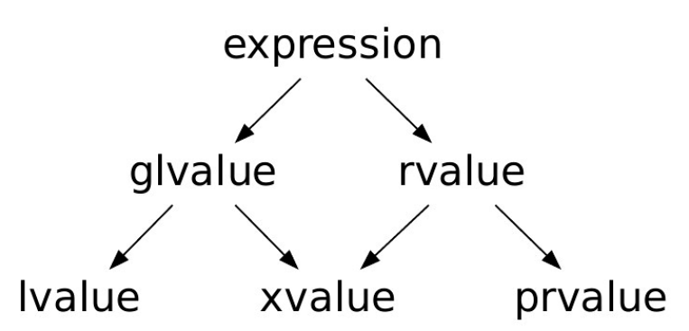
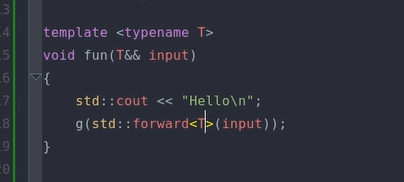
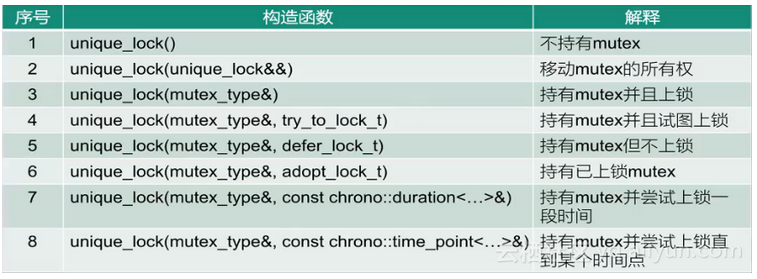

## C++ 面经整理

[TOC]

####  C++程序编译过程

1. 编译过程分为四个过程：预处理 + 编译 + 汇编 + 链接

+ 预处理：生成翻译单元（后缀名为`.i`，源文件 + 相关头文件（直接/ 间接）- 应忽略的预处理语）
+ 编译：将源码 .cpp 文件翻译成 .s 汇编代码；
+ 汇编：将汇编代码翻译成机器指令 .o 文件（目标文件）；
+ 链接：将这些文件对应的目标文件连接成一个整体，从而生成可执行的程序文件。

2. 链接分为两种：
   + 静态链接：以.lib或者.a为后缀。在链接阶段将各种库文件和相关文件集成到可执行文件中，本质上是在编译链接时直接将需要的执行代码拷贝到调用处
     + 优点：装载速度很快，运行速度比动态链接快；
     + 缺点：可执行文件很大；执行文件较大 ；
   + 动态链接：以.so为后缀。把对一些库函数的链接载入推迟到程序运行的时期，可以实现进程之间的资源共享，本质上在编译时记录一系列符号和参数，将动态库加载到内存中，在运行到指定代码时，在共享执行内存中加载的动态库可执行代码，实现运行时链接；
     + 优点：可执行文件较小；开发耦合性较小，程序更新部署不需要全部编译；
     + 缺点：速度没有静态链接快；不具有自完备性，如果用户缺少动态库则无法运行；

#### 指针和引用的区别是什么

+ 指针可以为空；引用必须绑定对象，总的来说比指针安全。
+ 指针所指向的内存空间在程序运行过程中可以改变；而引用所绑定的对象一旦绑定就不能改变。
+ 指针可以有多级，但是引用只能一级，即不存在引用的引用。（是否能为多级）
+ 引用属于编译期概念，在底层还是通过指针实现
+ 如果返回动态内存分配对象，必须用指针，否则可能引起内存泄漏。

#### 变量的声明和定义有什么区别

变量的定义为变量分配地址和存储空间， 变量的声明不分配地址。一个变量可以在多个地方声明，加入extern 修饰的是变量的声明，说明此变量将在翻译单元外部进行定义；

#### nullptr 比 NULL 优势

nullptr 比 NULL 更安全，它是有类型的，而`NULL`是预处理变量，是一个宏，值是 0；在函数重载等情况下NULL容易被误解

#### 讲述下C++中的左值和右值，移动语义和完美转发

1. 左右值的基础类型：

   

   + glvalue：泛左值，标识一个对象、位或者函数，可以是`lvalue`和`xvalue`；
   + prvalue：纯右值，用于初始化对象或作为操作数
   + rvalue：将亡值，表示其资源可以被重新使用；
   + const 对应的变量也是一个左值；T&&对应右值引用；

2. 右值引用：形如`int && a`，右值最大的特点就是无名且不需要存储空间。

3. 移动语义：`std::move()`，将一个泛左值修改为一个将亡值，后续将不再继续修改该数值。特别适合对独占指针的移动；

4. 完美转发：`std::forward`，它的作用是保持原来的值属性不变，如果原来的值是左值，经std::forward处理后该值还是左值；如果原来的值是右值，处理后它还是右值。[参考资料](https://zhuanlan.zhihu.com/p/161039484)

####  完美转发是用来解决什么问题的？

完美转发为了解决引用折叠问题，引用折叠就是：如果间接创建一个引用的引用，那么这些引用就会折叠. 一个右值引用是左值。

#### 什么是浅拷贝和深拷贝？

浅拷贝就是增加了一个新指针指向原来的地址，那么改变原有对象也会改变新对象。而深拷贝则是开辟了新的内存空间，并增加一个指向该空间的指针。

#### 类型的自动推导：auto 和 decltype 

+ auto: 最常用的形式，但会产生类型退化。特别是在引用中，当定义另外一个引用等于当前引用时，自动推导实际上是新建了一个变量，而非对原始变量的另外一个引用；auto不能用于含有递归的匿名函数。

+ decltype(.)：不会产生类型退化的类型推导。如果是左值则加引用 ，如果左值是变量名称则不加

  + decltype(exp/val)：返回表达式/变量的类型，可以通过括号来设计是否引用

    ```c++
    *ptr -> int;
    decltype(*ptr) -> int&;
    // 通过括号来设计是否引用
    decltype((int)) -> int&;
    decltype(int) -> int;
    ```

  + decltype(auto) ：从 c++14 开始支持，简化 decltype 使用

  + concept auto ：从 C++20 开始支持，表示一系列类型（ std::integral auto x = 3; 自动类型推导会被限制在`std::integral`类型中）

#### C++有什么编译优化参数？

+ O0 不做任何优化，这是默认的编译选项。
+ O1 优化会消耗少多的编译时间，它主要对代码的*分支，常量以及表达式*等进行优化。 
+ O2 会尝试更多的*寄存器级的优化以及指令级的优化*，它会在编译期间占用更多的内存和编译时间。 
+ O3 在O2的基础上进行更多的优化，例如使用伪寄存器网络，*普通函数的内联*，以及*针对循环的更多优化*。 

#### 什么时候会发生段错误

+ 访问了不存在的地址，比如试图修改null指针的值
+ 访问了受保护的地址：`int *p = 0; (*p) = 1;`
+ 试图修改只读区，比如修改字面值常量
+ 栈溢出，无限递归
+ new一次但是delete多次。

#### 讲一下内存溢出和内存泄露

1. 内存溢出：是指申请内存时申请的空间不够，比如申请的int型的内存空间，但是存进去一个long型的数据。
   + 内存中加载的数据量过于庞大，比如一次性从数据库中读取大量数据。
   + 代码中出现死循环或者循环产生过多重复的实体。
   + 启动参数内存值设定的过小。

2. 内存泄露：是指申请内存空间之后，没有释放申请的内存空间。
   + new创建出来的对象没有及时的delete掉，导致了内存的泄露；
   + delete一个`void*`的指针可能会造成内存上的泄露。因为delete一个`void*`的对象指针，它不会调用析构函数，导致内存泄漏。
   + new创建了一组对象数组，内存回收的时候却只调用了delete而非delete []来处理，导致内存泄露；

#### 堆和栈有什么区别？

+ 堆是动态分配的，其空间的分配和释放都由程序员控制，栈是栈是由编译器自动管理的；
+ 堆来说，频繁使用分配内存会造成内存空间的不连续，产生大量碎片，栈不会，因为栈具有先进后出的特性；
+ 栈顶和栈底是预设好的，大小固定，堆是不连续的内存区域，其大小可以灵活调整；
+ 堆是从内存的低地址向高地址方向增长，栈是从内存的高地址向低地址方向增长；

#### 内存的分配方式有几种？

+ 在**栈**上分配：**局部变量**在栈上分配，函数结束时会自动释放。**效率很高，但内存容量有限**；
+ 从**堆**上分配：由程序去控制；
+ 从**常量存储区**分配：特殊的存储区，存放的是常量，不可修改；
+ 从**全局/静态存储区**分配：全局变量和静态变量被分配到同一块内存中，在该区定义的变量若没有初始化，则会被自动初始化

#### 静态内存分配和动态内存分配有什么区别

+ 静态内存分配是在编译时期完成的，动态内存分配是在运行时期完成的；
+ 静态内存分配是在栈上分配的（或者全局变量、常量）；动态内存分配是在堆上分配的；
+ 静态内存分配是按计划分配的，在编译前确定内存块的大小；动态内存分配是按需要分配的；
+ 静态内存分配的运行效率比动态内存分配高
+ 静态内存分配不需要指针或引用类型的支持；动态内存分配需要；

#### 指针常量和常量指针有什么区别？

以`*`为界，const出现在左侧，内容不改变；const出现在右侧，指针不修改；

```c++
int x = 4;
int* const ptr = &x; // ptr本身不能改变
const int* ptr = &x; // ptr指向的内容不改变
```

#### this指针

+ this指针指向被调用的成员函数所属的对象

+ this指针隐式的加在每个成员函数中

#### lambda表达式

lambda 表达式：小巧灵活，功能强大

+ C++11 ~ C++20 持续更新：

  + C++11 引入lambda 表达式
  + C++14 支持初始化捕获、泛型lambda
  + C++17 引入constexpr lambda ，*this 捕获
  + C++20 引入concepts ，模板lambda

+ **底层实现**： lambda 表达式会被编译器翻译成类进行处理

+ **基本组成部分**：参数与函数体、返回类型、捕获、说明符、模板形参（C++20 ）

  + example：

    ```c++
    // 显示的指出返回类型
    auto x = [](int val) -> bool
    { 
        return val > 3 && val < 10;
    };
    // 隐式自动推导返回类型
    auto x = [](int val){ return val > 3;};
    std::cout << x(5) << std::endl;
    ```

  + 捕获：针对函数体中使用的局部自动对象进行捕获。存在值捕获、引用捕获与混合捕获，缺省捕获；this 捕获；初始化捕获（C++14 ）；*this 捕获（C++17 ）多种方式

    ```c++
    // 局部值捕获, static不需要捕获
    int y = 10; 
    auto x = [y](int val) -> bool { return val > y; };
    // 引用捕获
    auto x = [&y](int val) -> bool { return val > y; };
    // 编译器分析用到了哪些变量，传递方式为值捕获，适用于传入值比较多的情况；
    auto x = [=](int val) -> bool { return val > y; };
    // 编译器分析用到了哪些变量，传递方式为引用捕获，适用于传入值比较多的情况；
    auto x = [&](int val) -> bool { return val > y; };
    // 一般在类中使用，调用类
    auto x = [&, this](int val) -> bool { return val > y; };
    // this可能会内存不安全，但是会有复制的开销
    auto x = [&, *this](int val) -> bool { return val > y; };
    // 初始化捕获，初始化只需要执行一次，而如果不使用初始化构造则会多次操作；
    auto res = [z = x + y](int val) -> bool { return val > z; };
    ```

  + 说明符：mutable / constexpr (C++17) / consteval (C++20)

    ```c++
    // 编译不通过，无法修改y，因为相当于 函数const
    auto x = [y](int val)
    {
        y++;
        return val > y; 
    };
    // 编译通过，函数内部参数可改
    auto x = [y](int val) mutable
    {
        y++;
        return val > y; 
    };
    // constexpr保证优先在编译期阶段进行调用，consteval 保证只能在编译期进行调用
    auto lam = [](int val) constexpr
    {
        return val++; 
    };
    constexpr int val = lam(100);
    ```

  + 模板形参（c++20）：之前可以用auto解决

    ```c++
    // 模板
    auto lam = []<typename T>(T val){ return val++; };
    int val = lam(100);
    // auto
    auto lam = [](auto val){ return val++; };
    ```

+ 深入用法：

  1. 即调用函数表达式：一般用于初始化常量表达式计算上

     ```c++
     const auto val = [z = x + y](int val){ return z; }();
     ```

#### 为什么要引入泛型算法？有什么特点？

+ 为什么要引入泛型算法？如`std::sort(x.begin(),x.end())`而不采用方法`x.sort()`的形式：

  1. 方法是指类里面实现的函数，但是内建数据类型不支持方法
  2. 计算逻辑存在相似性，采用了模板的方式，避免重复定义

+ 泛型算法的特点：

  + 使用迭代器作为算法与数据的桥梁，因此实现支持多种类型
  + 泛型算法通常来说都不复杂，但优化足够好
  + 一些泛型算法与方法同名，实现功能类似，此时建议调用方法而非算法。如：std::find V.S. std::map::find

#### bind操作

bind ：基于已有的逻辑灵活适配，但描述复杂逻辑时语法可能会比较复杂难懂

+ **功能**：C++11 引入，用于修改可调用对象的调用方式
+ **example**：如`std::bind(fun, 0, std::placeholders::_1, 2)`表示函数固定了函数的第1个参数为0，第3个参数为2；第2个参数（也是占位符第1个参数）需要填写；
+ **缺点**：调用std::bind 时，传入的参数会被复制，这可能会产生一些调用风险；只能绑定一个函数，因此不支持重载（lambda可以用auto或者模板解决）；

#### 说一说extern“C”

extern “C”的主要作用就是为了能够正确实现C++代码调用其他C语言代码。加上extern “C”后，会指示编译器这部分代码按C语言（而不是C++）的方式进行编译。

#### C 语言的关键字 static 和 C++ 的关键字 static 有什么区别

在 C 中 static 用来修饰局部静态变量和外部静态变量、函数。而 C++中除了上述功能外，还用来定义类的成员变量和函数。即静态成员和静态成员函数。

#### 悬挂指针与野指针有什么区别？

- 悬挂指针：当指针所指向的对象被释放，但是该指针没有任何改变，以至于其仍然指向已经被回收的内存地址，这种情况下该指针被称为悬挂指针；
- 野指针：未初始化的指针被称为野指针。

#### static的作用是什么，什么情况下用到static？

+ static修饰类变量：该变量仅在每个类（而不是每个实例）中存在一次，并且仅会在.cpp文件中被定义。该变量可以在类中声明，但是必须要在类外定义。
+ static修饰类函数：不需要通过类即可访问该函数。
+ 局部变量用static声明，则是为该变量分配的空间在整个程序的执行期内都始终存在；外部变量用static来声明，则该变量的作用只限于本文件模块，且编译器会自动对其初始化。 

#### 初始化列表的价值：

如果类中存在一个const 变量，如果不使用初始化列表方法，那么将会因为已经预先创建而报错。

#### 智能指针解决的问题：

+ 堆中指针导致的**内存泄露**：当指向堆的指针改变时，由于无法自动管理堆中数据，且该部分数据空间无法再次通过指针等其他形式再次访问和删除，将造成内存泄露

+ 堆中指针导致的**指针悬空**：当两个堆指针指向同一块内存，删除某一个指针，另一个指针不清楚内存已经被释放，仍然试图访问，造成悬空

#### 内存对齐的概念？为什么会有内存对齐？

1. 内存对齐：编译器将程序中的每个“数据单元”安排在字的整数倍的地址指向的内存之中

2. 内存对齐的原则：

   + 结构体变量的首地址能够被其最宽基本类型成员大小与对齐基数中的较小者所整除；
   + 结构体每个成员相对于结构体首地址的偏移量 （offset） 都是该成员大小与对齐基数中的较小者的整数倍，如有需要编译器会在成员之间加上填充字节 （internal padding）；
   + 结构体的总大小为结构体最宽基本类型成员大小与对齐基数中的较小者的整数倍，如有需要编译器会在最末一个成员之后加上填充字节 （trailing padding）。

3. 内存对齐的优点：

   + 便于在不同的平台之间进行移植，因为有些硬件平台不能够支持任意地址的数据访问；

   + 提高内存的访问效率，因为 CPU 在读取内存时，是一块一块的读取。

#### inline 内联函数的特点有哪些？与define相比如何？

1. 特点：

   + 编译器在编译期直接对函数进行了类似替换的行为，只用于简单的函数，避免了栈的生成和销毁造成性能的提升；

   + 使用`inline`进行声明时，需要在翻译单元内进行定义，最好是只有定义；inline是将程序级别的一次定义变成了翻译单元的一次定义。

   + 它可以避免相同函数重写多次的麻烦，编译器在链接的时候就不会重复进行定义，而是会将重复定义的函数自动删除；它减少了运行时间但是增加了空间开销。
   + 如果函数体内有循环，那么执行函数代码时间比调用开销大。

2. 与define相比：内联函数在编译时展开，而宏是由预处理器对宏进行展开；内联函数会检查参数类型，宏定义不检查函数参数 ，所以内联函数更安全。

#### C++的容器原理及优缺点

容器包括：**序列容器，关联容器，适配器生成器**

##### 序列容器

1. **array** ：元素**个数固定**的序列容器；

   + **底层实现**：底层依靠数组实现；
   + **容器的功能特点**：由于维护数组而非指针，swap速度较慢

2. **vector** ：元素**连续存储**的序列容器；

   + **底层实现**：vector底层是一个动态数组，包含三个迭代器，start和finish之间是已经被使用的空间范围，end_of_storage是整块连续空间包括备用空间的尾部；
   + **内存增长机制**：当空间不足时，会自动申请另一片更大的空间（1.5倍或者2倍），然后把原来的数据拷贝到新的内存空间，接着释放原空间。注意：一旦引起了空间的重新配置（主要在写操作中），指向原vector的所有迭代器会都失效了；
   + **内存清空机制**：使用clear()命令时，其存储空间不释放，仅仅是清空了里面的数据；使用shrink_to_fit()命令时可以降低其capacity和size匹配。同时使用两条指令可以清空内容并释放内存；
   + **容器的功能特点**：vector 不提供push_front / pop_front，因为效率太差；swap 效率较高，因为值交换指针，并不会因为长度变化而变化；
   + **注意事项**：vector的底层实现要求连续的对象排列，引用并非对象，没有实际地址，因此vector的元素类型不能是引用。

   + **vector迭代器失效的情况**

     + 当插入一个元素到vector中，由于引起了内存重新分配，所以指向原内存的迭代器全部失效。
     + 当删除容器中一个元素后,该迭代器所指向的元素已经被删除，那么也造成迭代器失效。erase方法会返回下一个有效的迭代器，所以当我们要删除某个元素时，需要it=vec.erase(it);。

   + **vector内存的释放方式**

     + vec.clear()：清空内容，但是不释放内存。

     + vec.shrink_to_fit()：请求容器降低其capacity和size匹配。

     + vec.clear();vec.shrink_to_fit();：清空内容，且释放内存。

3. **forward_list / list** ：基于**链表 / 双向链表**的容器；

   + **list 底层实现**：list的底层是一个双向链表，以结点为单位存放数据，结点的地址在内存中不一定连续，每次插入或删除一个元素，就配置或释放一个元素空间。
   + **list 容器的功能特点**：list不支持随机存取，插入、删除成本较低，但随机访问成本较高；写操作通常不会改变迭代器的有效性；支持`splice`等切片插入等；
   + **forward_list容器特点**：单向链表，是一个成本较低的线性表实现，因此只支持递增操作，不支持size操作，不支持pop_back / push_back；

4. **deque** ：**vector 与list 的折衷**

   + **底层实现**：deque是一个双向开口的连续线性空间（双端队列），相当于分成连续空间段，每段之间用链表连接。
   + **容器的功能特点**：push_back / push_front 速度较快；在序列中间插入、删除速度较慢；deque的迭代器比vector迭代器复杂很多；

5. **basic_string** ：提供了对**字符串**专门的支持；

##### 关联容器

1. map 、set、multiset、multimap的特点

   + **底层实现**：set / map / multiset / multimap 底层使用红黑树实现，

     + 有序，查找的时间复杂度O(logn)；

     + 红黑树特点：搜查树（左子树小于根节点，右子树大于根节点）+平衡树（左子树和右子树最多相差1层）；遍历时采用了中序遍历，因此是有序的；

   + map/set 迭代器所指向的对象是const 的，不能通过其修改元素；

   + multiset / multimap：使用 lower_bound / upper_bound / equal_range 返回查找到的区间

2. unordered_xx：

   + **底层实现**：是一个防冗余的哈希表（采用除留余数法）。哈希表最大的优点，就是把数据的存储和查找消耗的时间大大降低，时间复杂度为O(1)；而代价仅仅是消耗比较多的内存。
   + **容器特点**：与set / map 相比查找性能更好，但插入操作一些情况下会慢；

3. **为何map和set的插入删除效率比其他序列容器高，而且每次insert之后，以前保存的iterator不会失效**？

   因为存储的是结点，不需要内存拷贝和内存移动。插入操作只是结点指针换来换去，结点内存没有改变。而iterator就像指向结点的指针，内存没变，指向内存的指针也不会变

##### 适配器

功能：把不同类型统一到相同类型进行处理

1. **类型适配器**

   + **basic_string_view** （C++17 ）：

     统一了c++（string）和c字符串（char*），使接口更加灵活，代价也非常cheap；但是拒绝进行写操作，仅仅是string的一个窗口，一般也不会把string_view作为函数返回值；

     ```c++
     void fun(std::string_view s);
     ....
     fun("123456");
     fun(std::String("123456"));
     // 一个非常好的局部处理操作，不需要重新构建string
     std::string s = "123456";
     fun(std::String_view(s.begin(), s.begin()+3));
     ```

   + **span** （C++20 ）：可基于C 数组、array，vector等构造（连续空间），并且可读写

2. **接口适配器**

   + **stack**（栈，后进先出，底层实现是deque），**queue**（队列，先进先出，底层实现是deque），**priority_queue**（优先队列，底层实现是vector）
   + 对底层序列容器进行封装，对外展现栈、队列与优先级队列的接口

3. **数值适配器**（c++20，gcc10）：可以将一个输入区间中的值变换后输出

   + ranges库相关函数，std::ranges::XXX_view, std::ranges::views::XXX, std::views::XXX

   + 评价：比较好用，但是不需要gcc10不太现实诶

   + example：

     ```c++
     bool isEven(int i){ return i%2 == 0 };
     ...
     // 对vec中每个元素执行isEven，只有当结果为true时候才执行下一步
     for (auto p:std::ranges::filter_view(vec, isEven)){
     	cout << p << endl;
     }
     ```

##### 生成器（c++20）

   + 可以在运行期生成无限长或有限长的数值序列

   + std::ranges::itoa_view, std::ranges::views::itoa, std::views::itoa

   + example：

     ```c++
     // 生成1-9
     for (int i : std::ranges::itoa_view{1,10}){
     	...
     }
     // or
     for (int i : std::views::itoa(1,10)){
     	...
     }
     ```

#### 智能指针有几种？分别介绍一下他们的底层实现

+ 指针函数：

  1. `ptr.get()`：返回智能指针管理的原始指针
  2. `ptr.reset(raw_ptr)`：指针与指向原来对象对应的引用计数减1，若引用计数减为0则释放该对象内存；指针与指向新对象对应的引用计数加1；
  3. `ptr.reset()`：指针与指向原来对象对应的引用计数减1，若引用计数减为0则释放该对象内存；
  4. `ptr.use_count()`：查看计数器。

+ `shared_ptr`：基于计数的共享指针解决方案

  1. 包含一个指针和一个计数器，允许拷贝。但是每拷贝一次，计数器加一，每析构一次，计数器减一，为零时销毁。

  2. 不同方式构建函数：

     ```c++
     #include <memory>
     // Using default constructor Type();
     auto p = std::shared_ptr<Type>(new Type);
     auto p = std::make_shared<Type>(); // Preferred
     // Using constructor Type(<params>);
     auto p = std::shared_ptr<Type>(new Type(<params>));
     auto p = std::make_shared<Type>(<params>); // Preferred
     std::shared_ptr<int> p(new int[10],std::default_delete<int[]>()); 
     ```

  3. 指定函数析构

     ```c++
     std::shared_ptr<int> y(new int(100),fun);
     
     void fun(int* ptr){
     	std::cout << "Delete Ptr" << std::endl;
     	delete ptr;
     }
     ```

+ `unique_ptr`：独占内存的解决方案

  1. 没有拷贝构造函数，可以使用`std::move()`进行移动，但是不能赋值

  2. 指定析构函数：

     ```c++
     std::unique_ptr<int, decltype(&fun)> x(new int(3), fun);
     ```

+ `weak_ptr`：防止循环引用而引入的智能指针

  1. 循环引用：内存不会被销毁。一般用于类似于图的结构

     ```c++
     // 错误用法：x,y,m_nei都是shared_ptr
     x->m_nei = y;
     y->m_nei = x;
     // 错误用法：x,y是shared_ptr, m_nei是weak_ptr
     ```

  2. 基于shared_ptr 构造，但是并不会额外增加计数值：具体使用详见 lock 方法

+ 数组智能指针：

  1. unique_ptr的数组智能指针，没有*和->操作，但支持下标操作[]

  2. shared_ptr的数组智能指针，有*和->操作，但不支持下标操作[]，只能通过get()去访问数组的元素。

  3. shared_ptr的数组智能指针中：C++11必须要自定义deleter，C++17 支持`shared_ptr<T[]> `，C++20 支持`make_shared`分配数组

+ 常见错误：

  ```c++
  int a = 0;
  // Same happens with std::shared_ptr.
  auto a_ptr = std::unique_ptr<int>(&a);
  ```

  因为：此时a是位于栈上的而不是位于堆上。使用堆指针的最佳方法还是new一个新的；

#### 讲一下四种类型转换符

+ `static_cast<T1>(T2)` ：将T2转换为T1，但是不是所有类型都能完全转换；它可以在编译期执行；
+ `dynamic_cast<T1>(T2)`：在运行期执行，更加安全，但是性能稍差；可以用于在类的继承层次之间进行类型转换，它既允许向上转型，就是把继承类指针转换为基类指针；也允许向下转型。向上转型是无条件的，不会进行任何检测；向下转型的前提必须是安全的，只有一部分能成功。
+ `const_cast`：增加或者去除常量性（注意，可以去除）；
+ `reinterpret_cast`：对对应内存空间进行重新解释，类似于eigen中的Eigen::Map，但是也要遵循相关规范，一般只支持指针；

#### const和constexpr有什么区别？

传统const的问题在于“双重语义”，既有“只读”的含义，又有“常量”（不可改变）的含义，而constexpr严格定义了常量。

#### emplace_back()和push_back()哪个更好，为什么？

emplace_back()更好，因为它调用的是移动构造函数。而push_back()调用的是拷贝构造函数。移动构造函数不需要分配新的内存空间，所以更快一些。特别体现在对类的处理上。

#### 讲一下capacity(), size(), reserve(), resize() 函数的区别。

+ size()用于返回容器当前的元素个数。而capacity()返回容器的容量。

+ reserve只是开辟空间并不创建元素。而resize重新开辟空间并自动初始化元素。reserve()改变了capacity，size保持不变；resize()既改变了capacity，又改变了size。

+ resize(x,val)：
  + x > capacity，那么会在原容器内补充x-capacity个值为val的元素；
  + x <= capacity，那么容器内前x个元素值变为为val，其余不变

#### 谈一谈你对zero overhead（零开销原则）的理解

1. 不需要为没有使用的语言特性付出成本（虚函数）
2. 使用了一些语言特性不等于付出运行期成本（`consteval`：编译期执行，c++20特性）

#### 什么是STL？STL由哪些组件组成

STL由6个组件和13个头文件组成：

+ **容器**：一些封装数据结构的模板类，比如vector,list等。
+ **算法**：它们被设计为一个个模板函数，大部分位于 ，小部分位于。
+ **函数对象**：如果一个类将()重载为成员函数，那么这个类称为函数对象类，类的对象称为仿函数。
+ **迭代器**：容器对数据的读写是通过迭代器完成的，它充当容器和算法之间的胶合剂。
+ **适配器**：将一个类的接口设计成用户指定形式。

#### 内存管理

C++ 内存分区：**栈、堆、全局/静态存储区、常量存储区、代码区**。

+ 栈内存的特点：更好的局部性，对象自动销毁
+ 堆内存的特点：运行期动态扩展，需要显式释放

#### STL 的迭代器失效，怎么解决

1. 插入操作：
   + 对于vector和string，如果容器内存被重新分配，iterators,pointers,references失效；如果没有重新分配，那么插入点之前的iterator有效，插入点之后的iterator失效；
   + 对于deque，如果插入点位于除front和back的其它位置，iterators,pointers,references失效；当我们插入元素到front和back时，deque的迭代器失效，但reference和pointers有效；
2. 删除操作：
   + 对于vector和string，删除点之前的iterators,pointers,references有效；off-the-end迭代器总是失效的；
   + 对于deque，如果删除点位于除front和back的其它位置，iterators,pointers,references失效；当我们插入元素到front和back时，off-the-end失效，其他iterators,pointers,references有效；

#### new 和 malloc 的区别

+ new包括三个步骤：operator new( )分配内存，调用构造函数，返回指针
+ malloc 继承自c语言，相当于C++中的分配器（allocator ），只能够分配内存，但是不能构建对象；33

#### 为什么析构函数必须是虚函数？为什么默认的析构函数不是虚函数？

+ 效果：类似于`Father* p = new Son;`，如果基类不是虚函数，那么析构只会调用基类；如果基类是虚函数，则会先析构派生类再析构基类；
+ 为什么不默认虚函数：虚函数是有代价的，额外生成了虚函数表和虚表指针，无需清除时这种内存开销无疑是浪费的，因此一般是**使用基类指针**进行删除时才需要声明虚函数。

#### 面向对象的三大特征是哪些

封装：将客观事物封装成抽象的类，而类可以把自己的数据和方法暴露给可信的类或者对象，对不可信的类或对象则进行信息隐藏。

继承：可以使用现有类的所有功能，并且无需重新编写原来的类即可对功能进行拓展；

多态：一个类实例的相同方法在不同情形下有不同的表现形式，使不同内部结构的对象可以共享相同的外部接口。

#### 多态的实现有哪几种？

多态分为静态多态和动态多态。其中，静态多态是通过重载和模板技术实现的，在编译期间确定；动态多态是通过虚函数和继承关系实现的，执行动态绑定，在运行期间确定。

#### 动态绑定是如何实现的？

1. 虚表：具有一个基础的typeinfo，可以通过`dynamic_cast`来进行基类到派生类的类型转换（派生类到基类直接引用和指针指向即可），而其他派生不支持多态；
2. 当编译器发现类中有虚函数时，会创建一张虚函数表存放在全局数据区中，把虚函数的函数入口地址放到虚函数表中，并且在对象中增加一个指针`vptr`，用于指向类的虚函数表。当派生类覆盖基类的虚函数时，会将虚函数表中对应的指针进行替换，从而调用派生类中覆盖后的虚函数，从而实现动态绑定。

#### 虚函数表是针对类的还是针对对象的？

+ 虚函数表是针对类的，类的所有对象共享这个类的虚函数表；
+ 每个对象内部都保存一个指向该类虚函数表的指针`vptr`，每个对象的`vptr`的存放地址都不同，但都指向同一虚函数表。

#### 动态多态有什么作用？有哪些必要条件？

1. 动态多态的作用：
   + 隐藏实现细节，使**代码模块化**；
   + 接口重用，使派生类的功能可以被基类的指针/引用所调用，即**向后兼容**；
2. 动态多态的必要条件：**继承、虚函数、需要有基类指针/引用指向子类对象**；

#### 如果类A是一个空类，那么sizeof(A)的值为多少？

`sizeof(A)`的值为1，因为编译器需要区分这个空类的不同实例，分配一个字节，可以使这个空类的不同实例拥有独一无二的地址。

#### 覆盖（重写）和重载之间有什么区别？

+ 重写的函数名、参数列表、返回类型与父类完全相同，只是函数体不同；覆盖只发生在派生类的成员函数中；
+ 重载是指两个函数具有相同的函数名，不同的参数列表，不关心返回值；

#### 模板特化

对于某种特定类型，如果要实现其特有的功能，单一模板就无法做到，这时就需要模板特例化；模板类特化可以选择部分特化、完全特化等；

#### RTTI是什么？其原理是什么？

RTTI即运行时类型识别，其功能由两个运算符实现：

+ `typeid`运算符，用于返回表达式的类型，可以通过基类的指针获取派生类的数据类型；
+ `dynamic_cast`运算符，具有类型检查的功能，用于将基类的指针或引用安全地转换成派生类的指针或引用。

#### C++如何实现只在堆/栈上实例化对象

1. 只在堆上实例化对象：**将析构函数设置为保护**/私有。编译器在为类对象分配栈空间时，会先检查类的析构函数的访问性。若析构函数不可访问，则不能在栈上创建对象。**然后，设置静态成员变量进行创建和析构；**

2. 只能在栈上实例化对象：**将 new 和 delete 重载为私有**。

   ```c++
   class A
   {
   private:
   	void* operator new(size_t t){}     // 注意函数的第一个参数和返回值都是固定的
   	void operator delete(void* ptr){} // 重载了new就需要重载delete
   public:
   	A(){}
   	~A(){}
   };
   ```

#### new/delete和malloc/free之间有什么关系？

1. new一般分为两步：内存分配和调用构造；而malloc只有内存分配，不会调用构造；delete与free同理。
2. new与delete直接带具体类型的指针；malloc和free返回void类型的指针。
3. new类型是安全的，会进行编译器检查；而malloc不是。

#### 友元 friend

1. 功能：外部函数在类中被标记为友元时，可以访问类内所有成员函数和变量。
2. 隐藏友元：即使友元在类内进行定义，但是作用域仍然是全局的（类外的）；
3. 继承与友元：**友元关系无法继承，但基类的友元可以访问派生类中基类的相关成员**

#### 模板形参的万能引用（T &&）

1. 不再像普通函数中表示右值：同时处理传入参数是左值或右值的情形，推荐使用；

   + 如果实参表达式是右值，那么模板形参被推导为去掉引用的基本类型
   + 如果实参表达式是左值，那么模板形参被推导为左值引用，触发引用折叠

2. 完美转发应用：函数中使用万能引用作为函数形参时，右值引用的变量是左值，只有使用完美转发才能避免

   

#### 了解RAII吗？介绍一下？

+ RAII：资源获取初始化，是C++语言的一种管理资源、避免泄漏的用法。编程使用系统资源时，都必须遵循一个步骤：申请资源、使用资源、释放资源。

+ RAII典型案例：
  1. 资源管理：智能指针 shared_ptr与weak_ptr 自动内存管理。   
  2. 状态管理：线程锁、unique_lock、lock_guard\<mutex>、mutex互斥量、

#### 变长模板（Variadic Template ）

1. 形参包

   ```c++
   // case1:
   template<int... T>
   void fun(){};
   fun<1,3,5>();
   
   // case2:
   template<typename... T>
   void fun(T... args){
       std::cout << sizeof...(args); // 包含了多少个参数
   };
   fun<double, int, char>(3, 5.3, 'c');
   
   // case3:
   template<template<typename> class... T>
   void fun(){};
   
   // case4: c++11标准包展开操作
   void fun_ref() {
       /* 结尾为空时退出 */
   	cout << "pargs size = 0\t Do nothing, quit." << endl;
   }
   template<class Ts, class... Us> void fun_ref(Ts& value, Us&... pargs) {
       /* 每次读取最前侧的值 */
   	cout << "pargs size = " << sizeof...(pargs) + 1
   		<< "\tcurrent value type = " << typeid(Ts).name()
   		<< "\tcarrent value = " << value
   		<< "\n";
       // 递归调用，每次调用后 value 取代 pargs 第一个参数，直至为空
       fun_ref(pargs...);
   }
   
   // case5: c++17折叠表达式
   template<class... Us> void fun_ref(Us&... pargs) {
   	((cout << "\tcarrent value = " << pargs << endl), ...);
   }
   ```

2. 通过包展开技术操作变长模板参数：参考cppreference

3. [折叠表达式](https://en.cppreference.com/w/cpp/language/fold)

   ```c++
   template<typename ...Args>
   int sum(Args&&... args)
   {
       // Error: operator with precedence below cast
   	// return (args + ... + 1 * 2);
       
       // Right:
       return (args + ... + (1 * 2)); 
   }
   ```

   + 基于逗号的折叠表达式应用
   + 折叠表达式用于表达式求值，无法处理输入（输出）是类型与模板的情形

#### C++11为什么引入enum class？

枚举值不能隐式地转换成其他类型

#### 平时会用到function、bind、lambda吗，都什么场景下会用到？

1. **function：代替回调函数中的函数指针**

2. **bind ：用于修改可调用对象的调用方式**

   + **example**：如`std::bind(fun, 0, std::placeholders::_1, 2)`表示函数固定了函数的第1个参数为0，第3个参数为2；第2个参数（也是占位符第1个参数）需要填写；
   + **缺点**：调用std::bind 时，**传入的参数会被复制**，这可能会产生一些调用风险；可以使用std::ref 或std::cref 避免复制的行为；**只能绑定一个函数**，因此不支持重载（lambda可以用auto或者模板解决）；

3.  **lambda 表达式**：

   + 底层实现：会被编译器翻译成类进行处理

   + 组成：参数与函数体、返回类型、捕获、说明符

   + 捕获：针对函数体中使用的局部自动对象进行捕获。存在值捕获、引用捕获与混合捕获，缺省捕获；this 捕获；初始化捕获（C++14 ）；*this 捕获（C++17 ）多种方式

     ```c++
     // 局部值捕获, static不需要捕获
     int y = 10; 
     auto x = [y](int val) -> bool { return val > y; };
     // 引用捕获
     auto x = [&y](int val) -> bool { return val > y; };
     // 编译器分析用到了哪些变量，传递方式为值捕获，适用于传入值比较多的情况；
     auto x = [=](int val) -> bool { return val > y; };
     // 编译器分析用到了哪些变量，传递方式为引用捕获，适用于传入值比较多的情况；
     auto x = [&](int val) -> bool { return val > y; };
     // 一般在类中使用，调用类
     auto x = [&, this](int val) -> bool { return val > y; };
     // this可能会内存不安全，但是会有复制的开销
     auto x = [&, *this](int val) -> bool { return val > y; };
     // 初始化捕获，初始化只需要执行一次，而如果不使用初始化构造则会多次操作；
     auto res = [z = x + y](int val) -> bool { return val > z; };
     ```

#### 多线程的锁

1. **mutex互斥锁**

   + 使用：互斥锁是一种简单的通过加锁的方式控制多个线程对共享资源的访问，互斥锁有两个状态，上锁与解锁(lock和unlock)。
   + 特点：互斥锁是一个原子操作，不会出现同时上锁的情况，同时，互斥锁具有唯一性，一旦上锁，其他线程不能够再将其锁住。
   + 缺点：如果在lock和unlock之间发生了异常，则可能永远不会执行到unlock，另一个进程将永远被挂起在那里等待。

2. **std::lock_guard**

   + 使用：自动释放锁，其原理是：声明一个局部的lock_guard对象，在其构造函数中进行加锁，在其析构函数中进行解锁。

   + example：

     ```c++
     mutex mut;
     void thread1()
     {
         while(share<20)
         {
             std::lock_guard<std::mutex> mtx_locker(mut);  //用lock_guard实现互斥锁
             if(share>=20)
                 break;
             share++;
             cout << "this is thread1! share is " << share << endl;
             Sleep(100);
         }
     }
     ```

3. **unique_lock**

   + unique_lock基本用法和lock_guard一致，在构造函数和析构函数中进行锁操作，不同的地方在于它提供了非常多构造函数。
   + 

#### 大端小端的区别、应用、如何判断大端小端

+ 大端：big endian，先高位再低位（高位在地址的前端， 67 45 23 01）
+ 小端：little endian，先低位再高位（ 01 23 45 67）
+ C++根据硬件需求自动选择大端还是小端；Java根据规范确定大端还是小端，具有易用性但是性能会牺牲

#### C++17 新特性：

+ 结构化绑定：一种语法糖，如`auto [u,v] = fun(a, b);`

+ 带初始化的 if 和 switch 语句：

  ```c++
  // 带有初始化的if语句应用
  if (status s = check(); s != status::success) {
  	return s;
  }
  // 初始化switch的应用
  namespace fs = std::filesystem;
  ...
  switch (fs::path p{name}; status(p).type()) {
  	case fs::file_type::not_found:
  		std::cout << p << " not found\n";
  		break;
  	case fs::file_type::directory:
  		std::cout << p << ":\n";
  		for (const auto& e : std::filesystem::directory_iterator{p}) {
  			std::cout << "- " << e.path() << '\n';
  		}
  		break;
  	default:
  		std::cout << p << " exists\n";
  		break;
  }
  ```

+ 自从 C++17 开始，可以在头文件中以 inline 的方式定义全局变量/对象

  ```c++
  class MyClass {
  	inline static std::string msg{"OK"}; // OK（自C++17起）
  	...
  };
  
  inline MyClass myGlobalObj; // 即使被多个CPP文件包含也OK
  ```

  + 在 C++ 里不允许在类里初始化非常量静态成员，可以在类定义的外部定义并初始化非常量静态成员，但如果被多个 CPP 文件同时包含的话又会引发新的错误；

+ 新属性和属性特性

  + `[[nodiscard]] `属性：保证返回值一定被调用。常用于函数中开辟内存空间，避免不使用返回值造成内存泄露

    ```C++
    [[nodiscard]] int fun(int a, int b);
    ```

  + ` [[maybe_unused]]`属性：该变量可能不会被使用；

  + `[[fallthrough]]`属性：避免编译器在 switch 语句中某一个标签缺少 break 语句时发出警告；

  + 属性现在可以用来标记命名空间，如用来舍弃命名空间：

    ```c++
    namespace [[deprecated]] DraftAPI {
    	...
    }
    ```

+ 嵌套命名空间：

  ```c++
  namespace A::B::C {
  ...
  }
  等价于：
  namespace A {
  namespace B {
  namespace C {
  ...
  }
  }
  }
  ```

  
