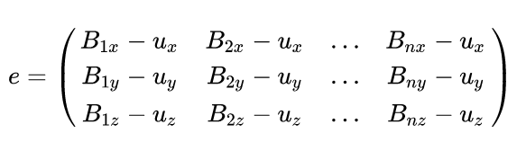
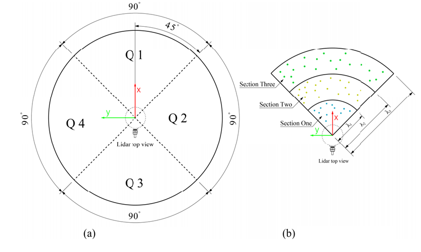
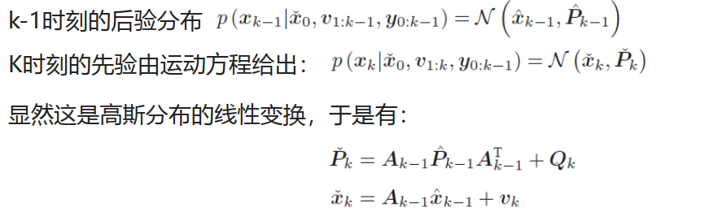
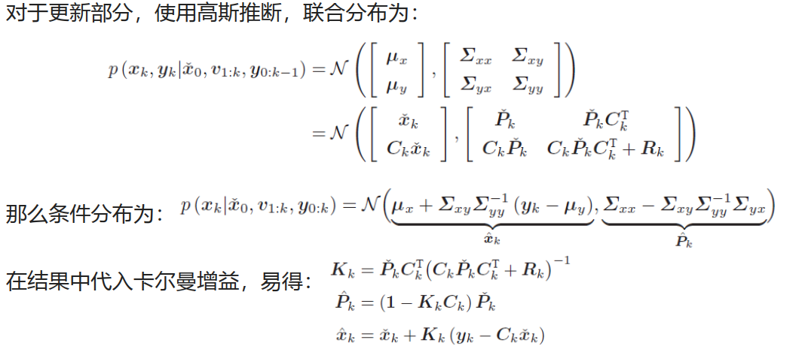
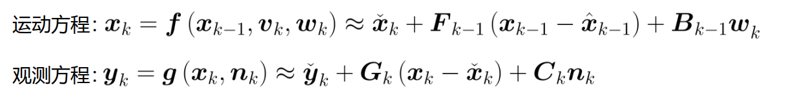
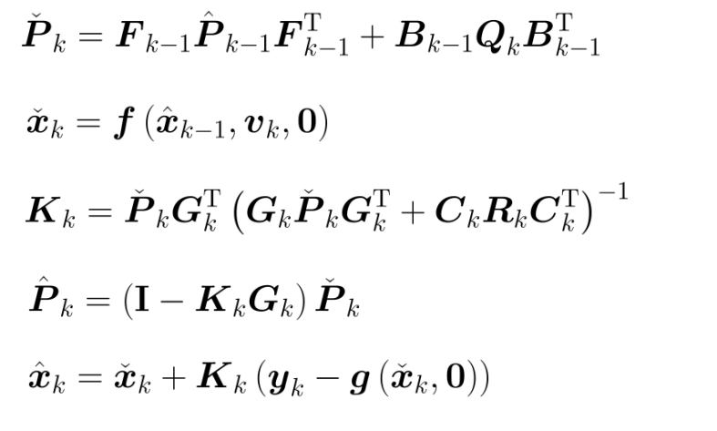

## SLAM相关问题答案

[TOC]

### IMU测量方程是什么？噪声模型是什么？

1. 测量方程：
   $$
   \phi = \frac{\omega_{k-1}+\omega_k}{2}(t_k-t_{k-1})\\
   R_{wb_k} = R_{wb_{k+1}}\left(I+\frac{\sin\phi}{\phi}\phi_{\times}+\frac{\cos\phi}{\phi^{2}}(\phi_{\times})^2\right) \\
   q_{wb_k} =q_{wb_{k+1}}\otimes\begin{bmatrix}\cos\frac{\phi}{2}\\\frac{\Phi}{\phi}\sin\frac{\phi}{2} \end{bmatrix}\\
   v_k = v_{k-1}+(\frac{R_{wb_k}a_k+R_{wb_{k-1}}a_{k-1}}{2})(t_k-t_{k-1})\\
   p_k = p_{k-1} + \frac{v_k+v_{k-1}}{2}(t_k-t_{k-1})
   $$

2. 噪声模型：

   IMU误差可以分为：确定性误差，随机误差。

   + **确定性误差**可以事先标定确定，包括：**bias**（为0时的恒定偏置 b）, **scale**（实际/理想），**非对齐误差**（scale + Misalignment ：3*3矩阵，对角阵为尺度因子）等；
   + **随机误差**通常假设噪声服从高斯分布，包括：**高斯白噪声**，**bias随机游走等**；

   总体而言：

   + **加速度计的误差模型**：$a^b_m=S_aR_{g}^a(a^G-g^G)+n_a+b_a$，其中$a^b_m$表示body系下加速度测量量，$g^G = [0,0, −9.81]^{\top}$。
   + **陀螺仪的误差模型**：$\omega^b_m=S_gw^b+n_g +b_g+s^g_{a}a^b$，最后一项仅仅在低端产品中出现。

### 惯导的误差模型推导？（15维）

1. 推导方法：

   + 写出不考虑误差的微分方程；（观测）
   + 写出考虑误差的微分方程；（预测）
   + 写出带误差的值与理想值之间的关系；（预测 = 观测 + 变化）
   + 将3) 中的关系带入 2)
   + 把1) 中的关系带入 4)

2. 推导结果：

   

### 多传感器之间如何对时？

这个问题相对比较复杂，首先分为两部分吧，时间戳的表述方式，和时间对齐方式。

首先是时间戳的表达方式，一般比较常见的包括Unix 时间戳，它记录的是UTC时间，或者是GPS时间戳，常用在GPS对时上，表达的是原子钟时间，然后根据时区的不同，可能还有相应的加减处理等；

对齐方式，首先说说实验室级别的对齐，这个要根据传感器不同来分类：

+ 激光雷达：通常采用PPS脉冲信号+NMEA消息。GPS时钟源的PPS端口每秒发送一次硬件脉冲（PPS信号），随后数据端口发送一次对应这个脉冲上升沿的时间信息（GPRMC格式）；当激光雷达接收到PPS信号时，会去置零微秒定时器。当合法有效的GPRMC信号到来的时候，系统抽取GPRMC信号中的时间，换算成整秒，修正激光雷达整秒的时间戳
+ 相机同步：
  + IMU、相机使用同一个时钟晶振：这样做的好处是不用考虑太多额外的因素，但是要求IMU和相机距离足够接近（这在自动驾驶场景下是不现实的），没有其他干扰，也不需要其他设备进行同步。
  + 以IMU时钟触发Camera曝光，适合比较简单的VIO系统
+ 工业级别：
  + 有一个专门的时钟源，晶振非常高，作为稳定时钟源，并采用卫星信号进行矫正；同时构造一个触发装置，在指定的时刻，发送触发信号，让所有的传感器触发成像，减少成像时刻误差。
  + NTP，PTP网络时间同步：利用网络报文进行矫正，前者能达到毫秒级，后者能够达到微秒级别；

### GPS双天线安装标定

车辆走直线后，采用GPS计算航迹，最小二乘算一下偏角。然后平移直接用尺子量就行。

### GPS存在延时，而IMU和轮速计都是实时的，如何处理？

这个方法没有亲身实现过，但是听别人讲过：大概就是把IMU当成预测，GPS或者Lidar里程计结果当成观测，用简单的卡尔曼滤波进行融合一下；这个也适用于SLAM计算过慢的情况。

### 常见的点云注册（registration）方法

#### 1. ICP算法系列 ：

+ **点到点的ICP**：
  + **公式**：$(R,t)=\arg\min\sum_{i=0}^N\omega_i||Rp_i+t-q_i||^2$，详细推导见资料：[SVD分解法](D:\网络课程\多传感器融合和定位 深蓝学院\第2章 3D激光里程计 I\svd_rot.pdf)。其中，权重$\omega_i$表示$p_i,q_i$之间的欧式距离是否小于手动阈值$d_{max}$，若小于则认为1，否则为0；
  + **优点**：定位精度高；
  + **缺点**：计算开销大且速度慢，对初始变换敏感，容易陷入局部最优解，会有离群点及噪声；采样场景不均匀时（如长走廊等环境）容易被产生误差造成发散；此外，由于需要记录点云，内存消耗大，不能适用于超大规模场景；
+ **点到线的ICP**：找到最近邻的两点，两点连线，以点到线的距离作为误差，[相关资料](https://mp.weixin.qq.com/s/r0YQa4uMUamIla2-dDy3fw)
  + **公式**：$(R,t)=\arg\min\sum_{i=0}^N\omega_i||n_i^{\top}(Rp_i+t-q_i)||^2$。其中，$n_i^{\top}$是最近邻两点连线的法线；
  + **优点**：误差度量方式更符合结构化场景中的雷达点云的实际情况，因此具有更小的误差；
  + **缺点**：它对非常大的初始位移误差的鲁棒性较差，因此需要比较精确的初始值。

+ **点到面的ICP**：

  + **公式**：$(R,t)=\arg\min\sum_{i=0}^N\omega_i||\eta_i(Rp_i+t-q_i)||^2$；式中，$\eta_i$是$q_i$处的表面法线
  + **优点**：点云的局部结构，精度更高，不容易陷入局部最优
  + **缺点**：优化是一个非线性问题，速度比较慢；

+ **广义迭代最近邻（GICP）**：ICP只考虑每一个点的残差，并没有考虑每个点的局部特征。要把ICP改为GICP只需要将欧氏距离替换为马氏距离。因此，也可以将GICP看做面到面的ICP

  + **公式**：$T = \arg_T\min\sum_i^Nd_{i}^{(T)}\ ^{\top}(C_i^B+T^{*}C_i^A(T^{*})^{\top})^{-1}d_{i}^{(T)}$

  + **流程**：

    1. 设点集B为点A1的K临近（K=20）,计算B均值；

    2. 将B中每一个量减去均值即可计算出error矩阵：

       

    3. 构造协方差矩阵来描述A1的局部特征：$\Sigma=\frac{ee^{\top}}{K}$，并对协方差$\Sigma$进行SVD分解；

    4. 找到3个量中最小的量$\xi$，即是法向量的特征值，令其等于一个超小量，比如1e-3，再将其他两个量设为1，得到新的$\Sigma^{1}$；

    5. 得到新的$\Sigma^{1}$后，利用SVD重构源协方差矩阵$\Sigma$，得到$C_i^A$或者$C_i^B$；

    6. 利用GICP代价公式求解；

  + **改进**：FastGICP，[文献解析](https://zhuanlan.zhihu.com/p/453290973)，[代码开源1](https://github.com/SLAMWang/fasterGICP)，[代码开源2（推荐）](https://github.com/SMRT-AIST/fast_gicp)；主要是剔除了平面性不强的点云（GICP基于平面假设近似协方差矩阵），数据关联点云滤波（残差较小的关联结果对位姿优化的贡献较少）。

+ **NICP**：充分利用实际曲面的特征来对错误点进行了滤除，主要使用的特征为法向量和曲率；[文献解析](https://blog.csdn.net/shoufei403/article/details/102972842)，[代码开源](https://github.com/yorsh87/nicp)：

  + **公式**：$(R,t)=\arg\min\sum_{i=0}^N\omega_i\left\|\begin{bmatrix}Rp_i+t\\ Rn_i\end{bmatrix}-\begin{bmatrix}p_i^{'}\\n_i^{'}\end{bmatrix}\right\|^2_{\Sigma}$
  + **流程**：
    1. 前几步同GICP的1-3步；
    2. 定义曲率$\sigma=\lambda_1/(\lambda_1+\lambda_2)$;
    3. 点云过滤：如果没有well define的法向量，则拒绝（即选择比较结构化的点，如果对应点周围过于杂乱就丢弃该点）；两点间的欧式距离($p$)大于阈值，则拒绝；两点的曲率（$\log\sigma$）之差距大于阈值，则拒绝；两点的法向量角度($n$)之差大于阈值，则拒绝。
  + **优点**：可以提前排除 一些明显是错误的匹配。这样就减少了计算量并且提高了计算结果的精度

+ **其他**：[VGICP]()，[tdr-gicp](https://zhuanlan.zhihu.com/p/433141609)

#### 2. NDT算法系列：

+ **P2D-NDT**：点到分布的NDT。将目标点云栅格化，每个栅格内的点云使用高斯分布来拟合。点到分布的NDT的目标函数是，找到一个变换T，使得待配准的点云经过变换后落入Target的栅格的高斯分布的似然概率最高。

  + **公式**：$\arg\min\sum_i^{N}(Ry_i+t-\mu)^{\top}\Sigma^{-1}(Ry_i+t-\mu)$
  + **流程**：
    1. 地图网格生成：将地图点云按照固定的分辨率划分到不同的三维网格中
    2. 计算每个网格点云的均值与协方差
    3. 投影与近邻关系搜索：根据初始位姿将待匹配点云投影到NDT地图中，并搜索得到与每个匹配点最近的地图网格；
    4. 计算代价值：根据每个待匹配点及其搜索到的地图网格，计算代价值，并且使用非线性迭代计算优化
  + **参数**：P2D-NDT对初值和栅格大小敏感，通常使用一个粗分辨率；NDT迭代次数少，一般5步内即可收敛，可以完全实时；
  + **优缺点**：比ICP更加鲁棒，计算开销更小；长于定位任务，弱于里程计任务；擅长处理平移，但在处理旋转方面表现一般；
  + [相关源码解析](https://mp.weixin.qq.com/s/TW50l7lThIogPV9H5qeAnw)

+ **D2D-NDT**：

  + **文献**：*Fast and Accurate Scan Registration through Minimization of the Distance between Compact 3D NDT Representations*，文献没下载成功因此没有仔细看过
  + **优点**：D2D相比P2D耗时更少，对初始估计不佳，分辨率过小的敏感性更低；
  + **缺点**：精度有所下降；

+ **NDT-Transform**：

  + NDT-Transform是一种三维点云的*实时、大规模地点识别*方法。

  + 3D NDT提供几何形状描述。NDT-transformer网络从一组3D NDT单元表示学习全局描述符。最后，使用查询数据库实现位置识别的描述符检索。
  + [代码开源](https://github.com/dachengxiaocheng/NDT-Transformer)
  + 其他相似算法：*You Only Hypothesize Once: Point Cloud Registration with Rotation-equivariant Descriptors*

+ **比较与分析**：

  + 优化思路与方向，参考[NDT文献汇总](https://blog.csdn.net/weixin_37669024/article/details/121853056)：
    + 向优化目标添加运动约束，因此在低信息环境（类似无尽的走廊）上的性能要高得多；
    + 引入三线性插值用于处理边界效应；
    + 引入三线性插值，导致更强的鲁棒性；
    + 迭代细分提高鲁棒性
    + 用于处理异常值/缺失数据的链接节点

#### 3. TEASER/TEASER++

+ **相关学习资料**：

  1. [论文翻译](https://mp.weixin.qq.com/s/kGF9cX7iUhq5x_1-KAiDSA)
  2. [开源代码](https://github.com/MIT-SPARK/TEASER-plusplus)

  2. [论文解析](https://mp.weixin.qq.com/s/eV4L5KbQWLHWa0tt48YHZA)
  3. [基础知识补充1](https://mp.weixin.qq.com/s/SGzIp_e33ExnrLERhopnPQ)
  4. [基础知识补充2](https://mp.weixin.qq.com/s/889jbDBR14xzDHBOztmRLQ)

+ **算法优点**：

  + 在尺度已知的情况下可以对99%的异常值鲁棒不受干扰；
  + 可以在毫秒级别完成计算，是现有的最快的鲁棒的配准算法；
  + 可以处理没有点对匹配的情况，即假定全集对全集的匹配，在这种情况下性能能够大幅度领先ICP；
  + 如果与基于深度学习的关键点检测算法搭配使用，可以大幅度提升点云配准的整体性能

+ **算法缺点**：

  + 不适合大尺度场景匹配

### 有哪些经典的激光SLAM算法？

#### 1. LOAM：

+ **特征表示**：根据激光单根线上前后各5个点与当前点的长度(激光点到雷达的距离)，计算曲率大小：
  $$
  c = \frac{1}{\|X\|}\sum_{i=0}(X-X_i)
  $$
  点的排列越平直差距越小，反之点排列越弯曲差距越大，曲率c越大。因此可以分类为以下4种：曲率特别大的点(sharp，角点或者线点)、曲率大的点(less_sharp，线点)、曲率小的点(less_flat，平面) 、曲率特别小的点(flat，面点或者平面)

  + 当$p_i$为 sharp 时，在上一帧中搜索离$p_i$最近的线特征点（ sharp 和 less_sharp），并在相邻线上再找一个线特征点，组成直线。
  + 当$p_i$为 flat 时，在上一帧中搜索离$p_i$最近的面特征点（flat和less_flat），并在相邻线上找两个面特征点，组成平面。
  + 不能超过设定的size，每个集合平面点4个，边缘点2个；已选取的点周围不能有点，使得点可以分布的更加均匀；

+ **代价函数**：

  1. 点到线：$d=\frac{(p_i-p_a)\times(p_i-p_b)}{|p_a-p_b|}$
  2. 点到面：$d=(p_i-p_j)\times\frac{(p_l-p_j)\times(p_m-p_j)}{|(p_l-p_j)\times(p_m-p_j)|}$

+ **扩展**：

  + [论文解读1](https://zhuanlan.zhihu.com/p/111388877)，[论文解读2](https://blog.csdn.net/robinvista/article/details/104379087)
  + A-LOAM：去掉了和IMU相关的部分；使用Ceres做迭代优化，简化了代码，但降低了效率
  + F-LOAM：使用残差函数的雅可比进行解析式求导

#### 2. LeGO-LOAM：

+ **主要贡献**：

  + 通过竖直角度的阈值判定进行地面分割（上下两根线点的距离在10度之内），且所有用于匹配的平面点仅使用地面点。因此减小了特征搜索范围；
  + 在非地面点中，使用BFS聚类后，簇中点的数量大于30才用来线特征匹配，因此提高了特征质量和匹配速度；
  + 里程计环节中，使用地面面特征优化高度和水平角，使用线特征优化水平位移和航向角；
  + 建图环节中，采用六自由度模型计算，需要提取稀疏化submap。同时以帧为单位进行优化，使得全局地图可以多次调整，而不像LOAM那样不可修改；
  4) 增加了回环修正模块：匹配用的是ICP，在SC-LeGO-LOAM也可以换成SC算法；

+ **后端优化公式**：

  + 基于回环的位姿修正误差扰动方程：
    $$
    \hat{e}_{ij}=\ln(T_{ij}^{-1}T_i^{-1}\exp((-\delta\xi_i)^{\wedge})\exp(\delta\xi_j^{\wedge})T_j)^{\vee}
    $$

  + 基于先验观测（RTK或者组合导航）的位姿修正：
    $$
    \hat{e}_{ij}=\ln(Z_i^{-1}\exp(\delta\xi_i^{\wedge})T_i)^{\vee}
    $$

+ **算法分析**：

  + 应对可变地面进行了地面优化，同时保证了轻量级。它是专门为地面车辆设计的SLAM算法，要求在安装的时候Lidar能以水平方式安装在车辆上；
  + [论文解读](https://zhuanlan.zhihu.com/p/115986186)，[论文解读2](https://zhuanlan.zhihu.com/p/426280500)

#### 3. T-LOAM

+ **多范围地面提取**：

  1. 原因：使用单一平面模型不足以精确表示复杂地形中的分布

  2. 流程：

     + 根据极径和方位角将点云划分为4象限，每个象限将进一步划分为几个相等的子区域

       

     + 提取种子点：计算每个区域中所有小于一定高度阈值的点，这就是提取平面所需要的点；

     + 对区域内点的协方差做分解，提取主方向，对每个主方向赋予权重后得到法向量

     + 利用平面拟合公式拟合平面；

+ **动态体素聚类（DCVC）**：

  1. 目的：

     + 不同深度点云的稀疏程度不同：考虑与传感器的距离，体素分割为扇形，距离越远，区域越大。

     + 横向和纵向尺度不同：考虑方向分辨率，可调整$\Delta\theta$和$\Delta\phi$的大小

     + 相邻点云深度突变： 考虑点的稀有性，调整$\Delta\rho$的大小

  2. 流程：

     + 首先将点云的直角坐标转换为极坐标，同时建立动态弯曲体素放入哈希表中；
     + 根据哈希表映射关系搜索当前点目标体素周围最近的体素，并将其合并到同一标签中；
     + 滤出微小的组和潜在的动态对象，以获得最终的点

+ **提取四种特征**：

  1. 目的：LOAM系列在几何退化情况下容易退化

  2. 特征分类 ：

     协方差矩阵后进行PCA主成分分析，依次计算曲率值，平整度和球度系数：
     $$
     \gamma=\frac{\lambda_3}{\lambda_1+\lambda_2+\lambda_3};\ 
     \sigma=\frac{\lambda_2-\lambda_3}{\lambda_1};\ \psi=\frac{\lambda_3}{\lambda_1}
     $$

     + 直边：相当于LOAM中的直线，可以通过曲率值来判断；注意这里没有用LOAM系利中的角点；
     + 平面：平面度系数$\sigma$大于阈值$\tau$，则提取点作为平面特征的垂直部分；
     + 球型：球面度系数$\psi$大于阈值$\pi$，则提取点作为球面特征的垂直部分；主要是提升鲁棒性用的
     + 地面：地面分割提取后的平面；

+ **截断最小二乘（TLS）**：

  1. 目的：抵抗每个特征残差的异常值

#### 4. LINS

+ **主要贡献**：
  1. 基于IESKF滤波器（ESKF + IEKF）实现Lidar与IMU，6自由度紧耦合估计的前端里程计。以IMU做状态预测，以特征中的点-面距离、点-线距离为约束(观测)，修正误差。
  2. scan2map匹配后就会利用gtsam对所有关键帧进行一次全局优化，而不仅仅是检测到回环的时候；
  3. [代码开源](https://github.com/ChaoqinRobotics/LINS---LiDAR-inertial-SLAM)
+ **相似工作**：
  1. FAST-LIO: A Fast, Robust LiDAR-inertial Odometry Package by Tightly-Coupled Iterated Kalman Filter
  2. [代码开源](https://github.com/hku-mars/FAST_LIO)

#### 5. LIO-SAM

+ **主要贡献**：
  1. 两步走策略：先通过点云特征计算出相对位姿，再利用相对位姿、IMU预积分和GPS做
     融合。相比于直接一步做紧耦合，大大提高了效率，而且实测性能也很优于直接紧耦合。
  2. 帧-局部地图匹配：因为IMU预计积分的存在，依赖帧帧匹配获取一个较好初始值的需求已经不存在了，并且帧-局部地图匹配减少了对全局地图的处理时间，精度也不会受到太大损失。
  3. [代码开源](https://github.com/TixiaoShan/LIO-SAM)，[论文讲解](https://zhuanlan.zhihu.com/p/153394930)

#### 6. LIO-Mapping

+ **主要贡献**：
  1. 基于滑动窗口方法，把雷达线/面特征、IMU预积分等的约束放在一起进行优化。
  2. 后端和VINS差不多；

### 常用三维点云采样方法有哪些？

+ **体素下采样**：最为常用的下采样方法。算法效率高，采样点分布均匀，点间距可控，但是不能精确控制采样点个数；
+ **均匀下采样**：以球体空间进行划分，点的位置不发生移动。准确度较高，但耗时提升；
+ **几何下采样**（曲率采样为例）：点云曲率越大的地方，采样点数越多。它的计算效率高，且局部点云是均匀采样的，稳定性高。该采样适用于不规则的且丰富表面特征的点云数据计算；
+ **增采样**：增加点云数据。适合用于解决曲面重建时点云数量缺少的问题；
+ **滑动最小二乘法**：对点云数量的扩充，但主要是对点云形状进行平滑处理，所以更适合用来对点云结构进行优化。

### 点云如何产生的？如何进行畸变补偿？

1. **点云畸变产生的原因**：

   本质上每个激光点的坐标都是相对于雷达的，雷达运动时（一般是顺时针运动），不同激光点的坐标原点会不同，因此产生了点云畸变。比如：平移导致的畸变（扫描标准圆为螺旋线），旋转导致的畸变（扫描标准圆为缺口圆）；

2. **点云畸变矫正方法**：[参考](https://zhuanlan.zhihu.com/p/109379384)

   + 获取载体运动信息：一般情况下，imu测量角速度，轮式里程计测量线速度；
   + 获取该激光点相对于起始时刻的时间差：有时间戳时候可以用时间戳，没有可以计算得到；
   + 坐标系对齐：将点云与雷达起始扫描位置进行对齐，包括雷达点云坐标、加速度和角速度。
   + 坐标系反推：利用时间差获得相应的变换矩阵，并对点云进行逆变换；

3. **点云去畸变效果**:

   畸变补偿除了提高定位精度以外，对地图质量，尤其是对消除路口转弯导致的地图重影有明显效果。

### 匹配问题有哪些解决方法？

+ **最近邻匹配**
  
  1. Kdtree在邻域查找上比较有优势，在小数据量的情况下，其搜索效率比较高，但在数据量增大的情况下，其效率会有一定的下降，一般是线性上升的规律。
  2. Octree算法实现简单，但大数据量点云数据下，其使用比较困难的是最小粒度（叶节点）的确定，粒度较大时，有的节点数据量可能仍比较大，后续查询效率仍比较低，反之，粒度较小，八叉树的深度增加，需要的内存空间也比较大（每个非叶子节点需要八个指针），效率也降低。
  3. 如果将Octree和Kdtree结合起来的应用，应用八叉树进行大粒度的划分和查找，而后使用Kdtree树进行细分，效率会有一定的提升，
  
+ **匈牙利算法**

  1. 属于二分图问题：简单来说就是两组集合U与V，其中U与V集合内部的点不能相互连通，但是U与V的点之间是可以联通的。特点为：无向图、交集为空、单集合内部禁止组合；

  2. 匈牙利算法核心思路：增广路取反，[参考文章](http://data.biancheng.net/view/150.html)，[参考文章2](https://blog.csdn.net/lx_ros/article/details/123980953)

     

  3. 匈牙利算法特点：基于最大流算法简化，速度较快，但是匹配不稳定；

  4. 改进：KM算法（Kuhn-Munkres 算法），相当于带有权重的匈牙利算法；

+ **高斯混合模型**

  1. 背景：K Means的算法缺点
     + 簇的半径为固定截断值，缺乏鲁棒性；
     + 拟合出来的簇为圆形，可能与实际数据分布（如椭圆）差别很大；
  2. 核心：
     + 高斯混合模型可以看作是由 K 个单高斯模型组合而成的模型；
     + 模型表述：
       1. 单高斯分布：$\log L(\theta) =\sum_{j=1}^{N}\log P(x_j|\theta)$，可以通过最大似然法求解
       2. 混合高斯：$\log L(\theta) =\sum_{j=1}^{N}\log(\sum_{k=1}^{K} \alpha_k\phi(x|\theta_k))$，对于每个观测数据点来说并不知道它是属于哪个子分布的，因此需要采用EM算法求解；
     + EM算法求解高斯混合模型：
       1. E-step：求期望。依据当前参数，计算每个数据来自子模型的可能性；
       2. M-step：求极大。根据上一轮的结果计算相应参数
       3. 重复迭代，直到结果收敛；
     + 超参数$K$可以通过手动调参确定，部分算法提供了诸如AIC或BIC评价方法；
     + 参考文献：[高斯混合模型（GMM）](https://zhuanlan.zhihu.com/p/30483076)，[最佳聚类实践：高斯混合模型](https://zhuanlan.zhihu.com/p/81255623)

### 卡尔曼滤波的推导

1. 贝叶斯相关知识：贝叶斯推断可以理解为贝叶斯公式的运用，它是指，如果已知先验概率密度函数 ，以及传感器模型 ，那么就可以根据贝叶斯公式推断出后验概率密度。

2. 贝叶斯视角推导过程：

   

   

3. 理解卡尔曼：[相关参考视频](https://www.bilibili.com/video/BV1ez4y1X7eR?spm_id_from=333.1007.top_right_bar_window_custom_collection.content.click&vd_source=0dc435c19d2243d812952aa7d93b3c74)

4. 扩展卡尔曼：

   

   

5. 多传感器融合框架下的ESKF算法：

   **流程框架**

   + 初始化：状态量、初始方差、过程噪声和观测噪声
   + 惯性解算：包括姿态、速度、位置
   + Kalman 预测更新：执行kalman五个步骤中的前两步，即预测状态量和预测方差；
   + 无观测时的量测更新：
     + 直接赋值等价；
   + 有观测时的量测更新
     + 执行kalman滤波后面的三个步骤，得到后验状态量
     + 更新后验位姿；
     + 状态量清零，方差不变；

   其他相关细节详见PPT（多传感器融合定位）；

### 卡尔曼滤波调参

首先根据IMU或者其他传感器的误差给出一个大概的估值，然后放大或者缩小相关参数，和真值比较；

### 平均旋转与插值的方法

+ 结论：这个问题目前不存在解析解，可以通过数值求解的方式计算；或者如果采样的姿态较为接近，可以采用四元数求平均的方式近似计算。
+ 为什么不使用欧拉角分别插值：姿态空间插值的一个主要问题是姿态空间的三个自由度是相互耦合的，而不像位置空间一样三个自由度完全解耦正交。所以，直接对欧拉角三个角度分别插值，可能存在奇异性或者错误结果，且插补后的刚体角速度不恒定
+ 使用四元数slerp插值：Slerp插值可以认为是最短路径插值，类似于位置空间的直线插值。但是，Slerp插值只能保证一阶连续，过渡点处的角速度方向会发生突变。公式表述为：$\text{Slerp}(q_0,q_1,t)=q_0(q_0^{-1}q_1)^{t}$。更多资料参考[wiki资料](https://en.wikipedia.org/wiki/Slerp)；
  + 使用Eigen库的实现如下：`Eigen::Quaternionf q = q1.slerp(t, q2);`
  + 为提高速度，利用角度进行插值：[参考资料](https://zhuanlan.zhihu.com/p/87418561)
+ 使用数值求解方法进行旋转平均：使用黎曼度量下的距离进行处理，表示最短测地线的弧长。计算方法如下（参考论文为：*Rotation averaging* ）：
  + 初始化：令$\bar{x}\gets x_i$；
  + 迭代计算：$\omega=\frac{1}{N}\sum_{i=1}^{N}\log(\bar{x}^{\top}x_i)$
  + 迭代更新：$\bar{x}\gets\bar{x}\exp(\omega),\ \text{if}\ \| \omega\|>\xi$，其中$\xi$为给定阈值；
+ 使用数值方法进行旋转插值：[参考资料](https://zhuanlan.zhihu.com/p/88780398)
  + 公式表述为：$R_1\exp(t\log(R^{-1}_1R_2))$
+ 多个四元数之间插值求解：**Squad插值算法**
+ 其他思考：计算两个 SO(3) 元素之间的距离虽然是能求旋转矩阵的平均，但是忽略了不同导致姿态变化的因素对旋转矩阵的影响的权重以及影响方式是不一样的，究其根本原因在于这些方法本质上假设机器人的姿态在欧拉角空间中随机分布。重点在于你的原始数据是什么，在传感器直接采样的参数的空间里取平均才是最准确的。

### 矩阵数值求逆的方法

### SVD分解

### 最小二乘法的推导

