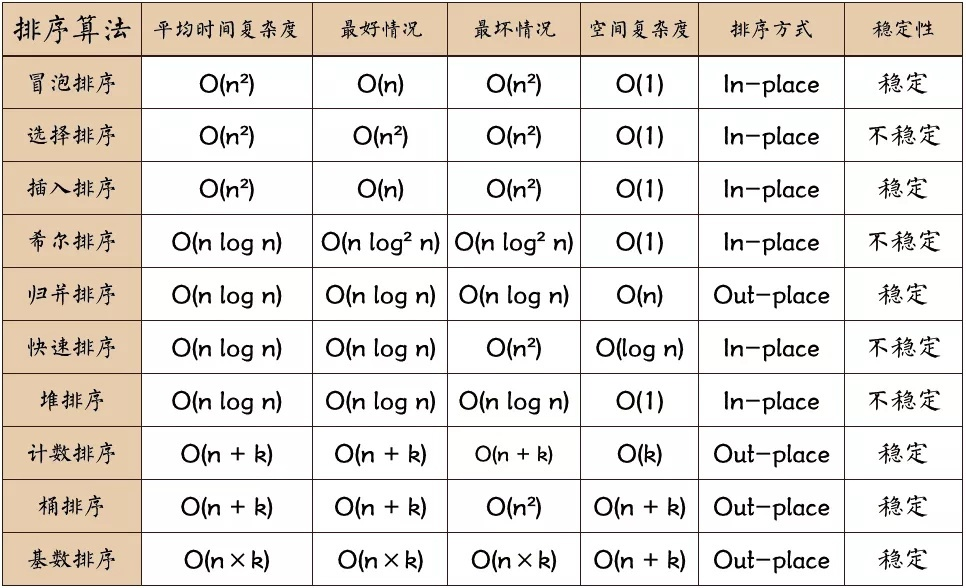

# 面试汇总

[TOC]

## 1 基础算法代码题解

### 1.1 0-1背包相关问题

1. **物品只被放入一次，求最大价值和**。即纯0-1背包问题

   ```cpp
   vector<int> dp(bagWeight + 1, 0);
   for(int i = 0; i < weight.size(); i++) { // 遍历物品
   	for(int j = bagWeight; j >= weight[i]; j--) { // 遍历背包容量
   		dp[j] = max(dp[j], dp[j - weight[i]] + value[i]);
   	}
   }
   ```

   + [分割等和子集](https://leetcode.cn/problems/partition-equal-subset-sum/)、[最后一块石头的重量 II](https://leetcode.cn/problems/last-stone-weight-ii/)：`vector<int> dp(sum/2+1);`

     [目标和](https://leetcode.cn/problems/target-sum/)：`int bagWeight = (target + sum)/2; vector<int> dp(bagWeight+1);`

2. **物品被放入多次，求最大价值和**。即完全背包问题，完全背包物体顺序无所谓；

   ```cpp
   for(int i = 0; i < weight.size(); i++) { // 遍历物品
       for(int j = weight[i]; j <= bagWeight ; j++) { // 遍历背包容量
           dp[j] = max(dp[j], dp[j - weight[i]] + value[i]);
       }
   }
   ```

3. **背包容量固定，求多少种可能性**。经典题目：[目标和](https://leetcode.cn/problems/target-sum/)，[零钱兑换 II](https://leetcode.cn/problems/coin-change-2/)，

   ```c++
   vector<int> dp(bagWeight+1);
   dp[0] = 1;
   for (int i=0; i<weight.size(); ++i){
   	for (int j=weight[i]; j<=bagWeight; ++j){
   		dp[j] += dp[j - weight[i]];
   	}
   }
   return dp[bagWeight];
   ```

   + 变形：**字符串判断**，例如[单词拆分](https://leetcode.cn/problems/word-break/)

     ```c++
     dp[0] = true;
     for (int i = 1; i <= s.size(); i++) {   // 遍历背包
     	for (int j = 0; j < i; j++) {       // 遍历物品
             string word = s.substr(j, i - j); //substr(起始位置，截取的个数)
             if (wordSet.find(word) != wordSet.end() && dp[j]) {
                 dp[i] = true;
             }
         }
     }
     ```

   + 变形：**求解最小数量**，例如[279完全平方数](https://leetcode.cn/problems/perfect-squares/)，[322零钱兑换](https://leetcode.cn/problems/coin-change/)

     ```c++
     int INT_MAX = std::numeric_limits<int>::max();
     vector<int> dp(n + 1, INT_MAX);
     dp[0] = 0;
     for (int i=1; i<coins.size(); ++i){
     	for (int j = coins[i]; j<= amount; ++j){
     		dp[j] = min(dp[j], dp[j-coins[i]] +1 );
     	}
     }
     ```

4. **两个维度**的0-1背包问题：[474一和零](https://leetcode.cn/problems/ones-and-zeroes/)

   ```c++
   for (int i = m; i >= zeroNum; i--) { // 遍历背包容量且从后向前遍历！
   	for (int j = n; j >= oneNum; j--) {
   		dp[i][j] = max(dp[i][j], dp[i - zeroNum][j - oneNum] + 1);
   	}
   }
   ```

### 1.2 公共子序列/子串相关题目

1. 基础类型：[1143最长公共子序列](https://leetcode.cn/problems/longest-common-subsequence/)，[不相交的线](https://leetcode.cn/problems/uncrossed-lines/)

   ```cpp
   vector<vector<int>> dp(text1.size() + 1, vector<int>(text2.size() + 1, 0));
   for (int i = 1; i <= text1.size(); i++) {
   	for (int j = 1; j <= text2.size(); j++) {
   		if (text1[i - 1] == text2[j - 1]) {
   			dp[i][j] = dp[i - 1][j - 1] + 1;
   		} else {
   			dp[i][j] = max(dp[i - 1][j], dp[i][j - 1]);
   		}
   	}
   }
   return dp[text1.size()][text2.size()];
   ```

   + [392判断子序列](https://leetcode.cn/problems/is-subsequence/)：`return dp[m-1][n-1] == s.size() ? true : false;`

   + [583两个字符串的删除操作](https://leetcode.cn/problems/delete-operation-for-two-strings/)：`return m+n-2-2*dp[m-1][n-1];`

   + [718最长重复子数组](https://leetcode.cn/problems/maximum-length-of-repeated-subarray/)：注意这里变成了*子串/子数组*，表示选择是连续的。

     ```cpp
     int results = 0;
     for (int i = 1; i <= A.size(); i++) {
         for (int j = 1; j <= B.size(); j++) {
             if (A[i - 1] == B[j - 1]) {
                 dp[i][j] = dp[i - 1][j - 1] + 1;
             }
             result = max(dp[i][j], result);
         }
     }
     ```

### 1.3 二分查找相关算法

1. 二分法：

   + **无重复有序数组，区间左闭右闭**

     ```c++
     int search(vector<int>& nums, int target) {
     	int left = 0;
          // 定义target在左闭右闭的区间里，[left, right]
     	int right = nums.size() - 1;
         // 当left==right，区间[left, right]依然有效，所以用 <=
     	while (left <= right) { 
                 int middle = left + ((right - left) / 2);
                 if (nums[middle] > target) {
                     right = middle - 1; // target 在左区间，所以[left, middle - 1]
                 } else if (nums[middle] < target) {
                     left = middle + 1;
                 } else {
                     return middle; 
                 }
             }
             return -1;
         }
     ```
     
   + **无重复有序数组，区间左闭右开**

     ```c++
     int search(vector<int>& nums, int target) {
     	int left = 0;
         // 定义target在左闭右开的区间里，即：[left, right)
         int right = nums.size();
         // 因为left == right的时候，在[left, right)是无效的空间，所以使用 <
     	while (left < right) {
     		int middle = left + ((right - left) >> 1);
             if (nums[middle] > target) {
                 right = middle; // target 在左区间，在[left, middle)中
             } else if (nums[middle] < target) {
                 left = middle + 1; 
             } else { 
                 return middle; 
             }
         }
         return -1;
     }
     ```
     
   + **有重复有序数组，寻找左边界/右边界**。如[34在排序数组中查找元素的第一个和最后一个位置](https://leetcode.cn/problems/find-first-and-last-position-of-element-in-sorted-array/)

     + c++STL库：

       ```c++
       vector<int> searchRange(vector<int>& nums, int target) {
           // 二分查找第一个大于或等于num的数字
       	auto left = lower_bound(nums.begin(), nums.end(), target);
           // 二分查找第一个大于num的数字
       	auto right = upper_bound(nums.begin(), nums.end(), target);
       	if (left == right)
               return vector<int>{-1, -1};
       	else
               return vector<int>{(int)(left - nums.begin()), (int)(right - nums.begin() - 1)};
       }
       ```

     + 不调用库函数：相似题目[35搜索插入位置](https://leetcode.cn/problems/search-insert-position/)

       ```c++
       int lowerBound(vector<int>& nums, int target) {
           int left = 0, right = nums.size() - 1;
           while (left <= right) {
               int mid = (left + right) / 2;
               if (nums[mid] >= target) // 这里选择等于 >=
               {
                   right = mid - 1;
               }else{
                   left = mid + 1;
               }
           }
       	return left;
       }
       int upperBound(vector<int>& nums, int target) {
           int left = 0, right = nums.size() - 1;
           while (left <= right) {
               int mid = (left + right) / 2;
               if (nums[mid] > target) // 这里选择等于 >
               {
                   right = mid - 1;
               }else{
                   left = mid + 1;
               }
           }
       	return left;
       }
       ```

     + 相似题目：

       1. [x 的平方根 ](https://leetcode.cn/problems/sqrtx/)：对于``0 <= x <= 2^31 - 1`，有：
       
          ```c++
          long long base = (long long)mid * mid;
          ```
       
       2. [搜索二维矩阵](https://leetcode.cn/problems/search-a-2d-matrix/)：选择`lowerBound`和`upperBound`至关重要

2. 查找的扩展：

   + 隐式查找：数字位置关系映射。如：[540有序数组中的单一元素](https://leetcode.cn/problems/single-element-in-a-sorted-array/)

     ```c++
     int singleNonDuplicate(vector<int>& nums) {
         if (nums.size() == 1)
             return nums[0];
         int left = 0, right = nums.size()-1;
         while(left <= right){
             int mid = (right - left)/2 + left;
             if (mid %2 == 1){
                 if (nums[mid] == nums[mid - 1]){
                     left = mid + 1;
                 }else{
                     right = mid - 1;
                 }
             }else{
                 if (nums[mid] == nums[mid + 1]){
                     left = mid + 1;
                 }else{
                     right = mid - 1;
                 }
             }
         }
         return nums[left];
     }
     ```

   + [找到 K 个最接近的元素](https://leetcode.cn/problems/find-k-closest-elements/)

     ```c++
     // case1
     vector<int> findClosestElements(vector<int>& arr, int k, int x) {
         sort(arr.begin(),arr.end(),
              [&](int &a,int &b){return abs(a-x)==abs(b-x)?a<b:abs(a-x)<abs(b-x);});
         vector<int> res(arr.begin(), arr.begin() + k);
         sort(res.begin(), res.end());
         return res;
     }
     // case2
     vector<int> findClosestElements(vector<int>& arr, int k, int x) {
         int left = 0;
         int right = arr.size() - k;
         while(left < right)
         {
             int mid = (right - left)/2 + left;
             // 关键：x = (arr[mid] + arr[mid+k])/2
             if(2*x > arr[mid + k] + arr[mid]) left = mid + 1;
             else right = mid;
         }
         return vector<int>(arr.begin() + left, arr.begin() + k + left);
     }
     ```
     
   + 旋转数组系列题目（基本都是左闭右开类型扩展）：[153、154寻找旋转排序数组中的最小值](https://leetcode.cn/problems/find-minimum-in-rotated-sorted-array/)，[162寻找峰值](https://leetcode.cn/problems/find-peak-element/)，[81搜索旋转排序数组 II](https://leetcode.cn/problems/search-in-rotated-sorted-array-ii/)
   
     ```c++
     // 无重复元素
     int findMin(vector<int>& nums) {
         int left = 0, right = nums.size() - 1;
         while (left < right) {
             int mid = left + (right - left) / 2;
             // 翻转符号就能够得到最大值
             if (nums[mid] < nums[right]) right = mid;
             else left = mid + 1;
         }
         return nums[left];
     }
     // 有重复元素
     int findMin(vector<int>& nums) {
         int left = 0, right = nums.size() - 1;
         while (left < right) {
             int mid = left + (right - left) / 2;
             if (nums[mid] < nums[right]) right = mid;
             else if (nums[mid] > nums[right]) left = mid + 1;
             else right--;
         }
         return nums[left];
     }
     // 寻找峰值
     int findPeakElement(vector<int>& nums) {
         int left = 0, right = nums.size() - 1;
         while (left < right) {
             int mid = left + (right - left) / 2;
             if (nums[mid] > nums[mid+1]) right = mid;
             else left = mid + 1;
         }
         return left;
     }
     /* TODO 81 */
     ```

### 1.4 回溯问题模板

1. 组合问题1：**无重复**数组中，找出**固定数量（k个）数字**，**不允许重复**。[组合总和 III](https://leetcode.cn/problems/combination-sum-iii/)

   ```c++
   public:
       vector<vector<int>> result; // 存放符合条件结果的集合
       vector<int> path; // 用来存放符合条件结果
   
   	// 回溯函数
       void backtracking(int targetSum, int k, int sum, int startIndex) {
           if (path.size() == k) {
               if (sum == targetSum) result.push_back(path);
               return; // 如果path.size() == k 但sum != targetSum 直接返回
           }
           for (int i = startIndex; i <= 9; i++) {
               sum += i; // 处理
               path.push_back(i); // 处理
               backtracking(targetSum, k, sum, i + 1); // 注意i+1调整startIndex
               sum -= i; // 回溯
               path.pop_back(); // 回溯
           }
       }
   	
   	// 主函数
       vector<vector<int>> combinationSum3(int k, int n) {
           backtracking(n, k, 0, 1);
           return result;
       }
   ```

2. 组合问题2：**无重复**元素数组中，选取**未定个数**，**允许重复**

   ```c++
   for (int i = startIndex; i < candidates.size(); i++) {
       sum += candidates[i];
       path.push_back(candidates[i]);
       backtracking(candidates, target, sum, i); // 关键点:不用i+1了，表示可以重复读取当前的数
       sum -= candidates[i];   // 回溯
       path.pop_back();        // 回溯
   }
   ```

3. 组合问题3：有**重复元素数组**中，选取**未定个数**，**不允许重复**。[组合总和 II](https://leetcode.cn/problems/combination-sum-ii/)

   ```c++
   public:
       vector<vector<int>> result;
       vector<int> path;
   
       void backtracking(vector<int>& candidates, int target, int sum, int startIndex, vector<bool>& used) {
           if (sum == target) {
               result.push_back(path);
               return;
           }
           
           for (int i = startIndex; i < candidates.size() && sum + candidates[i] <= target; i++) 
          {
               if (i > 0 && candidates[i] == candidates[i - 1] \
                   	  && used[i - 1] == false) 
                   continue;
           
               sum += candidates[i]; path.push_back(candidates[i]); used[i] = true;
               backtracking(candidates, target, sum, i + 1, used); 
               used[i] = false; sum -= candidates[i]; path.pop_back();
           }
       }
   
   public:
       vector<vector<int>> combinationSum2(vector<int>& candidates, int target) {
           vector<bool> used(candidates.size(), false);
           // 首先把给candidates排序，让其相同的元素都挨在一起。
           sort(candidates.begin(), candidates.end());
           backtracking(candidates, target, 0, 0, used);
           return result;
       }
   ```

4. 变形：**切割**问题。[131分割回文串](https://leetcode.cn/problems/palindrome-partitioning/)

   ``` c++
   for (int i = startIndex; i < s.size(); i++) {
       // 符合要求，存储；如果不是则直接跳过
       if (isPalindrome(s, startIndex, i)) { 
           string str = s.substr(startIndex, i - startIndex + 1);
           path.push_back(str);
       } else {                
           continue;
       }
       backtracking(s, i + 1);
       path.pop_back(); 
   }
   ```

5. 变形：**子集**问题

   ```c++
   void backtracking(vector<int>& nums, int startIndex) {
       	// 收集子集，要放在终止添加的上面，否则会漏掉自己
           result.push_back(path); 
           // 终止条件可以不加
   		........
       }
   ```

   + [子集](https://leetcode.cn/problems/subsets/)，[子集 II](https://leetcode.cn/problems/subsets-ii/)，[递增子序列](https://leetcode.cn/problems/increasing-subsequences/)

6. 全排列问题：

   + C++标准库：

     ```c++
     vector<vector<int>> res = {A};
     while (next_permutation(A.begin(),A.end())
     {
         res.push_back(A);
     }
     ```

   + 回溯写法（类似组合问题3）

     ```c++
     for (int i = 0; i < nums.size(); i++) {
     	if (used[i] == true) continue; // path里已经收录的元素，直接跳过
     	used[i] = true;
     	path.push_back(nums[i]);
     	backtracking(nums, used);
     	path.pop_back();
     	used[i] = false;
     }
     ```

   + 去重的全排列（和组合问题3一样）

     ```c++
     if (i > 0 && nums[i] == nums[i - 1] && used[i - 1] == false) {
     	continue;
     }
     if (used[i] == true) continue; // path里已经收录的元素，直接跳过
     ```

### 1.5 二叉树遍历相关题目

1. 基础递归法：

   ```c++
   // 前序遍历
   void traversal(TreeNode* cur, vector<int>& vec) {
   	if (cur == NULL) return;
   	vec.push_back(cur->val);    // 中
   	traversal(cur->left, vec);  // 左
   	traversal(cur->right, vec); // 右
   }
   // 中序遍历
   void traversal(TreeNode* cur, vector<int>& vec) {
       if (cur == NULL) return;
       traversal(cur->left, vec);  // 左
       vec.push_back(cur->val);    // 中
       traversal(cur->right, vec); // 右
   }
   // 后序遍历
   void traversal(TreeNode* cur, vector<int>& vec) {
       if (cur == NULL) return;
       traversal(cur->left, vec);  // 左
       traversal(cur->right, vec); // 右
       vec.push_back(cur->val);    // 中
   }
   ```

   + 二叉搜索树：

     ```
     void searchBST(TreeNode* cur) {
         if (cur == NULL) return ;
         searchBST(cur->left);       // 左
         （处理节点）                // 中
         searchBST(cur->right);      // 右
         return ;
     }
     ```

2. 迭代遍历法：

   ```c++
   // 前序遍历
   vector<int> preorderTraversal(TreeNode* root) {
   	stack<TreeNode*> st;
   	vector<int> result;
   	if (root == NULL) return result;
   	st.push(root);
   	while (!st.empty()) {
   		TreeNode* node = st.top();// 中
   		st.pop();
   		result.push_back(node->val);
   		if (node->right) st.push(node->right);// 右（空节点不入栈）
   		if (node->left) st.push(node->left);// 左（空节点不入栈）
   	}
   	return result;
   }
   // 中序遍历
   vector<int> inorderTraversal(TreeNode* root) {
   	vector<int> result;
   	stack<TreeNode*> st;
   	TreeNode* cur = root;
   	while (cur != NULL || !st.empty()) {
           if (cur != NULL) { // 指针来访问节点，访问到最底层
               st.push(cur); // 将访问的节点放进栈
               cur = cur->left; // 左
           }else{
               cur = st.top();
               st.pop();
               result.push_back(cur->val);     // 中
               cur = cur->right;               // 右
           }
      	}
       return result;
   }
   // 后序遍历
   vector<int> postorderTraversal(TreeNode* root) {
   	stack<TreeNode*> st;
   	vector<int> result;
   	if (root == NULL) return result;
   	st.push(root);
   	while (!st.empty()) {
   		TreeNode* node = st.top();
   		st.pop();
   		result.push_back(node->val);
   		if (node->left) st.push(node->left); // 相对于前序遍历更改入栈顺序
           if (node->right) st.push(node->right); // 空节点不入栈
       }
   	reverse(result.begin(), result.end()); // 将结果反转之后就是左右中的顺序了
   	return result;
   }
   ```

3. 层序遍历

   + 无返回值的基础型：

     ```c++
     // 非递归法
     vector<vector<int>> levelOrder(TreeNode* root) {
     	queue<TreeNode*> que;
     	if (root != NULL) que.push(root);
     	vector<vector<int>> result;
     	while (!que.empty()) {
     		int size = que.size();
     		vector<int> vec;
     		// 这里一定要使用固定大小size，不要使用que.size()
     		for (int i = 0; i < size; i++) {
     			TreeNode* node = que.front();
     			que.pop();
     			vec.push_back(node->val);
     			if (node->left) que.push(node->left);
     			if (node->right) que.push(node->right);
     		}
     		result.push_back(vec);
     	}
     	return result;
     }
     // 递归法
     void order(TreeNode* cur, vector<vector<int>>& result, int depth)
     {
         if (cur == nullptr) return;
         if (result.size() == depth) result.push_back(vector<int>());
         result[depth].push_back(cur->val);
         order(cur->left, result, depth + 1);
         order(cur->right, result, depth + 1);
     }
     vector<vector<int>> levelOrder(TreeNode* root) {
         vector<vector<int>> result;
         int depth = 0;
         order(root, result, depth);
         return result;
     }
     ```

     + [二叉树的最大深度](https://leetcode.cn/problems/maximum-depth-of-binary-tree/)：

       ```c++
       return results.size();
       ```
       
     + [222完全二叉树个数](https://leetcode.cn/problems/count-complete-tree-nodes/)，[513找左下角的值](https://leetcode.cn/problems/find-bottom-left-tree-value/)

   + 带有返回值的层次遍历：

     + [对称二叉树](https://leetcode.cn/problems/symmetric-tree/)

       ```c++
       bool compare(TreeNode* left, TreeNode* right) {
           if (left == NULL && right != NULL) return false;
           else if (left != NULL && right == NULL) return false;
           else if (left == NULL && right == NULL) return true;
           else if (left->val != right->val) return false;
       
           // 此时就是：左右节点都不为空，且数值相同的情况
           // 此时才做递归，做下一层的判断
           bool outside = compare(left->left, right->right); 
           bool inside = compare(left->right, right->left);  
           bool isSame = outside && inside;
           return isSame;
       }
       
       bool isSymmetric(TreeNode* root) {
           if (root == NULL) return true;
           return compare(root->left, root->right);
       }
       ```

     + [二叉树最小深度](https://leetcode.cn/problems/minimum-depth-of-binary-tree/)，[平衡二叉树](https://leetcode.cn/problems/balanced-binary-tree/submissions/)

       ```c++
           int getdepth(TreeNode* cur){
               if (cur->left == nullptr && cur->right == nullptr)
                   return 0;
               if (cur->left != nullptr && cur->right == nullptr) 
                   return 1+getdepth(cur->left);
               if (cur->left == nullptr && cur->right != nullptr) 
                   return 1+getdepth(cur->right);
               return 1+min(getdepth(cur->left), getdepth(cur->right));
           }
           int minDepth(TreeNode* root) {
               if (root == nullptr) return 0;
               return getdepth(root)+1;
           }
       ```
     
   + 带回溯模板的二叉树遍历：

     ```c++
     public:
     	void traversal(TreeNode* cur, string path, vector<string>& result) {
             path += to_string(cur->val); // 中
             if (cur->left == NULL && cur->right == NULL) {
                 result.push_back(path);
                 return;
             }
             // path的值没有改变：隐藏了回溯
             if (cur->left) traversal(cur->left, path + "->", result); // 左
             if (cur->right) traversal(cur->right, path + "->", result); // 右
         }
     
         vector<string> binaryTreePaths(TreeNode* root) {
             vector<string> result;
             string path;
             if (root == NULL) return result;
             traversal(root, path, result);
             return result;
     
         }
     ```

     + 例题：[112路径总和](https://leetcode.cn/problems/path-sum/)，[113路径总和2](https://leetcode.cn/problems/path-sum-ii/), [257二叉树所有路径](https://leetcode.cn/problems/binary-tree-paths/)，[左叶子之和](https://leetcode.cn/problems/sum-of-left-leaves/)

   + 返回节点的二叉树遍历：

     ```c++
     public:
         TreeNode* insertIntoBST(TreeNode* root, int val) {
             if (root == NULL) {
                 TreeNode* node = new TreeNode(val);
                 return node;
             }
             if (root->val > val) root->left = insertIntoBST(root->left, val);
             if (root->val < val) root->right = insertIntoBST(root->right, val);
             return root;
         }
     ```

     + [701二叉搜索树中的插入操作](https://leetcode.cn/problems/insert-into-a-binary-search-tree/)，[二叉树的最近公共祖先](https://leetcode.cn/problems/lowest-common-ancestor-of-a-binary-tree/)，[617合并二叉树](https://leetcode.cn/problems/merge-two-binary-trees/)
     
     + 模板：普通二叉树的删除方式。代码中目标节点（要删除的节点）被操作了两次：第一次是和目标节点的右子树最左面节点交换；第二次直接被NULL覆盖了。
     
       ```c++
           TreeNode* deleteNode(TreeNode* root, int key) {
               if (root == nullptr) return root;
               if (root->val == key) {
                   if (root->right == nullptr) { // 这里第二次操作目标值：最终删除的作用
                       return root->left;
                   }
                   TreeNode *cur = root->right;
                   while (cur->left) {
                       cur = cur->left;
                   }
                   swap(root->val, cur->val); // 这里第一次操作目标值：交换目标值其右子树最左面节点。
               }
               root->left = deleteNode(root->left, key);
               root->right = deleteNode(root->right, key);
               return root;
           }
       ```

4. 总结：

   在递归函数有返回值的情况下：

   + 如果要搜索一条边，递归函数返回值不为空的时候，立刻返回；

     ```c++
     if (递归函数(root->left)) return ;
     if (递归函数(root->right)) return ;
     ```

   + 如果搜索整个树，直接用一个变量left、right接住返回值，是后序遍历中处理中间节点的逻辑

     ```c++
     left = 递归函数(root->left);
     right = 递归函数(root->right);
     left与right的逻辑处理;
     ```


### 1.4 链表

### 1.5 双指针

1. 快慢指针：如[27移除元素](https://leetcode.cn/problems/remove-element/)

   ```c++
   int removeElement(vector<int>& nums, int val) {
       int slowIndex = 0;
       for (int fastIndex = 0; fastIndex < nums.size(); fastIndex++) {
           if (val != nums[fastIndex]) {
               nums[slowIndex++] = nums[fastIndex];
           }
       }
       return slowIndex;
   }
   ```

2. 前后指针：示例[977有序数组的平方](https://leetcode.cn/problems/squares-of-a-sorted-array/)

   ```c++
   vector<int> sortedSquares(vector<int>& A) {
       int k = A.size() - 1;
       vector<int> result(A.size(), 0);
       // 注意这里要i <= j，因为最后要处理两个元素
       for (int i = 0, j = A.size() - 1; i <= j;) { 
           if (A[i] * A[i] < A[j] * A[j])  {
               result[k--] = A[j] * A[j];
               j--;
           }
           else {
               result[k--] = A[i] * A[i];
               i++;
           }
       }
       return result;
   }
   ```

3. 滑动窗口：初始位置不同或者区间内满足一定要求

   + **区间内满足一定要求**：示例[209长度最小的子数组](https://leetcode.cn/problems/minimum-size-subarray-sum/)（注意要求是正整数）

     ```c++
     int minSubArrayLen(int s, vector<int>& nums) {
         int result = std::numeric_limits<int>::max();
         int sum = 0;
         int i = 0; // 滑动窗口起始位置
         int subLength = 0; // 滑动窗口的长度
         for (int j = 0; j < nums.size(); j++) {
             sum += nums[j];
             // 注意这里使用while，不断比较子序列是否符合条件
             while (sum >= s && i <) {
                 subLength = (j - i + 1); // 取子序列的长度
                 result = result < subLength ? result : subLength;
                 sum -= nums[i++]; // i而不是j，并不断变更i（子序列的起始位置）
             }
         }
         // 如果result没有被赋值的话，就返回0，说明没有符合条件的子序列
         return result == std::numeric_limits<int>::max() ? 0 : result;
     }
     ```
   
     + 相似题目：[713乘积小于 K 的子数组](https://leetcode.cn/problems/subarray-product-less-than-k/)
   
       ```c++
       while (product >= k && i <= j) {
           product /= nums[i++];
       }
       // 当区间范围为大于时候，在外部记录区间长度，等价于符合条件的组合可能性
       result += j - i + 1;
       ```
       
     + 相似题目：[930和相同的二元子数组](https://leetcode.cn/problems/binary-subarrays-with-sum/) 。这里题目数组有了0，就不能像209那样求解，而是利用差获得等于goal的数组：
   
       ```c++
       for (int j = 0; j < nums.size(); j++) {
           sum1 += nums[j];
           sum2 += nums[j];
           while (sum1 >  goal && i1 <= j) sum1 -= nums[i1++];
           while (sum2 >= goal && i2 <= j) sum2 -= nums[i2++];
           result += i2 - i1;
       }
       ```
       
     + 相似题目变形：[3无重复字符的最长子串](https://leetcode.cn/problems/longest-substring-without-repeating-characters/)， [904水果成篮](https://leetcode.cn/problems/fruit-into-baskets/)
   
       ```c++
       int lengthOfLongestSubstring(string s) {
           int i = 0;
           int window_len = 0;
           int max_len = 0;
           unordered_set<char> record;
           for (int j = 0; j < s.size(); j++) {
               while (record.count(s[j])) {
                   window_len = (j - i); // 不加1是因为当前位置是重复的，不计算在内
                   max_len = max_len > window_len ? max_len : window_len;
                   record.erase(s[i++]);
               }
               record.insert(s[j]);
           }
           window_len = s.size() - i; // 等于 j-i+1. 使用+1是因为最后一个是无重复字符
           max_len = max_len > window_len ? max_len : window_len;
           return max_len;
       }
       ```
       
       + 相似题目：[438找到字符串中所有字母异位词](https://leetcode.cn/problems/find-all-anagrams-in-a-string/)，[567字符串的排列](https://leetcode.cn/problems/permutation-in-string/)
       
         尽管这道题（438）乍一看上去是固定大小的滑窗，但是由于“异位”的概念用常规方法维护的复杂度较高，产生超时，因此将固定大小设置为条件使用；
   
   + **固定大小的滑动窗口**：
   
     示例[219存在重复元素 II](https://leetcode.cn/problems/contains-duplicate-ii/)
   
     ```c++
     bool containsNearbyDuplicate(vector<int>& nums, int k) {
         unordered_set<int> record;   
         for (int我 i = 0; i < nums.size(); i++) {
             if (i > k) record.erase(nums[i - k - 1]);
             if (record.count(nums[i])) return true;
             record.insert(nums[i]);
         }
         return false;
     }
     ```
   
     示例[239滑动窗口最大值](https://leetcode.cn/problems/sliding-window-maximum/)
   
     ```c++
     vector<int> maxSlidingWindow(vector<int>& nums, int k) {
         int n = nums.size();
         priority_queue<pair<int, int>> q;
         for (int i = 0; i < k; ++i) q.emplace(nums[i], i);
         
         vector<int> ans = {q.top().first};
         for (int i = k; i < n; ++i) {
             q.emplace(nums[i], i);
             while (q.top().second <= i - k) {
                 q.pop();
             }
             ans.push_back(q.top().first);
         }
         return ans;
     }
     ```
   
   + **初始位置不同**：示例[替换空格](https://leetcode.cn/problems/ti-huan-kong-ge-lcof/)
   
     ```c++
     int count = 0; // 统计空格的个数
     int sOldSize = s.size();
     for (int i = 0; i < s.size(); i++) {
         if (s[i] == ' ') {
             count++;
         }
     }
     // 扩充字符串s的大小，也就是每个空格替换成"%20"之后的大小
     s.resize(s.size() + count * 2);
     int sNewSize = s.size();
     // 从后先前将空格替换为"%20"
     for (int i = sNewSize - 1, j = sOldSize - 1; j < i;) {
         if (s[j] != ' ') {
             s[i--] = s[j--];
         }else {
             s[i--] = '0'; s[i--] = '2'; s[i--] = '%';
         }
     }
     return s;
     ```
   
   + **N数之和**：
   
     示例[15三数之和](https://leetcode.cn/problems/3sum/)，[18四数之和](https://leetcode.cn/problems/4sum/)
     
     ```c++
     vector<vector<int>> threeSum(vector<int>& nums) {
         vector<vector<int>> result;
         sort(nums.begin(), nums.end());
         // a = nums[i], b = nums[left], c = nums[right]
         for (int i = 0; i < nums.size(); i++) {
             if (nums[i] > 0) return result;
             if (i > 0 && nums[i] == nums[i - 1]) continue; // 去重
             
             int left = i + 1;
             int right = nums.size() - 1;
             while (left < right) {
                 if (nums[i] + nums[left] + nums[right] > 0) right--;
                 else if (nums[i] + nums[left] + nums[right] < 0) left++;
                 else {
                     result.push_back(\
     					ector<int>{nums[i], nums[left], nums[right]});
                     while (right > left && nums[right] == nums[right - 1])
                         right--;
                     while (right > left && nums[left] == nums[left + 1])
                         left++;
                     // 找到答案时，双指针同时收缩
                     right--;
                     left++;
                 }
             }
         }
         return result;
     }
     ```
   
     + 左右指针与哈希表集合：
       
       
        相似题目： [424替换后的最长重复字符](https://leetcode.cn/problems/longest-repeating-character-replacement/)
        
        ```c++
        int characterReplacement(string s, int k) {
            int n = s.size(); int total = 0;
            int ans = 0, left = 0, right = 0;
            vector<int> window(26,0);
            while (right < n) {
                window[s[right] - 'A']++;
                int max_nums = *max_element(window.begin(),window.end());
                if (right - left + 1 - max_nums <= k) {
                    ans = max(ans, right - left + 1);
                }else{
                    window[s[left] - 'A']--;
                    left++;
                }
                right++;
            }
            return ans;
        }
        ```
        
        相似题目：[395至少有 K 个重复字符的最长子串](https://leetcode.cn/problems/longest-substring-with-at-least-k-repeating-characters/)，利用字符串有限的隐藏特性
        
        ```c++
        int longestSubstring(string s, int k) {
            int n = s.size();
            int ans = 0;
            for (int kind_limit = 1; kind_limit <= 26; kind_limit++) {
                int left = 0;
                int right = 0;
                unordered_map<char, int> window;
                int total = 0;      // 窗口内字符种类
                int sat_total = 0;  // 满足「出现次数不少于 k」条件的，窗口内字符种类
        
                while (right < n) {
                    // 右边界入窗
                    window[s[right]]++;
                    if (window[s[right]] == 1) total++;
                    if (window[s[right]] == k) sat_total++;
                    // 当窗口内字符种类数超过限制时，左边界收缩
                    while (total > kind_limit) {
                        if (window[s[left]] == 1) total--;
                        if (window[s[left]] == k) sat_total--;
                        window[s[left]]--;
                        left++;
                    }
                    // 窗口内字符种类 等于 满足条件的字符种类时，取此时的窗口长度
                    if (total == sat_total) {
                        ans = max(ans, right - left + 1);
                    }
                    right++;
                }
            }
            return ans;
        }
        ```
        
        
   
### 1.6 回文相关题目

1. 回文**子串**可能的**个数**：[647回文子串](https://leetcode.cn/problems/palindromic-substrings/)

   ```c++
   for (int i = s.size() - 1; i >= 0; i--) {  // 注意遍历顺序
       for (int j = i; j < s.size(); j++) {
           if (s[i] == s[j]) {
               if (j - i <= 1) { // 情况一 和 情况二
                   result++;
                   dp[i][j] = true;
               } else if (dp[i + 1][j - 1]) { // 情况三
                   result++;
                   dp[i][j] = true;
               }
           }
       }
   }
   ```

2. 回文**子串**的**最大长度**：[5最长回文子串](https://leetcode.cn/problems/longest-palindromic-substring/)

   ```c++
   class Solution {
   public:
       string longestPalindrome(string s) {
           vector<vector<int>> dp(s.size(), vector<int>(s.size(), 0));
           int maxlenth = 0;
           int left = 0;
           int right = 0;
           for (int i = s.size() - 1; i >= 0; i--) {
               for (int j = i; j < s.size(); j++) {
                   if (s[i] == s[j]) {
                       if (j - i <= 1) { // 情况一 和 情况二
                           dp[i][j] = true;
                       } else if (dp[i + 1][j - 1]) { // 情况三
                           dp[i][j] = true;
                       }
                   }
                   if (dp[i][j] && j - i + 1 > maxlenth) {
                       maxlenth = j - i + 1;
                       left = i;
                       right = j;
                   }
               }
   
           }
           return s.substr(left, right - left + 1);
       }
   };
   ```

3. 回文**子序列**的**最大长度**：[516最长回文子序列](https://leetcode.cn/problems/longest-palindromic-subsequence/)

   ```c++
   int longestPalindromeSubseq(string s) {
   	vector<vector<int>> dp(s.size(), vector<int>(s.size(), 0));
   	for (int i = 0; i < s.size(); i++) dp[i][i] = 1;
       for (int i = s.size() - 1; i >= 0; i--) {
           for (int j = i + 1; j < s.size(); j++) {
               if (s[i] == s[j]) {
                   dp[i][j] = dp[i + 1][j - 1] + 2;
               } else {
                   dp[i][j] = max(dp[i + 1][j], dp[i][j - 1]);
               }
           }
       }
       return dp[0][s.size() - 1];
   }
   ```

4. **分割回文子串**，**罗列**所有分割方案：[131分割回文串](https://leetcode.cn/problems/palindrome-partitioning/)。解答详见回溯法章节

5. **分割回文子串**，计算最小**次数**：

   ```c++
   for (int i = s.size() - 1; i >= 0; i--) {
       for (int j = i; j < s.size(); j++) {
           if (s[i] == s[j]) {
               if (j - i <= 1) { // 情况一 和 情况二
                   isPalindromic[i][j] = true;
               } else if (isPalindromic[i + 1][j - 1]) { // 情况三
                   isPalindromic[i][j] = true;
               }
           }
       }
   }
   // 初始化
   vector<int> dp(s.size(), 0);
   for (int i = 0; i < s.size(); i++) dp[i] = i;
   
   for (int i = 1; i < s.size(); i++) {
       if (isPalindromic[0][i]) {
           dp[i] = 0;
           continue;
       }
   	for (int j = 0; j < i; j++) {
           if (isPalindromic[j + 1][i]) {
               dp[i] = min(dp[i], dp[j] + 1);
           }
       }
   }
   return dp[s.size() - 1];
   ```

### 1.7 优先队列/堆的相关题目

1. 优先队列自定义排序算法

   ```c++
   // case1
   struct cmp{
       bool operator()(ListNode* a, ListNode* b){
           return a->val > b->val;
       }
   };
   priority_queue<ListNode*, vector<ListNode*>, cmp> pq;
   
   // case2
   auto cmp = [&](ListNode* a, ListNode* b) -> bool{
       return a->val > b->val;
   };
   priority_queue<ListNode*, vector<ListNode*>, decltype(cmp)> pq(cmp);
   ```

2. 优先队列维护归并算法：[378有序矩阵中第 K 小的元素](https://leetcode.cn/problems/kth-smallest-element-in-a-sorted-matrix/)、[347前 K 个高频元素](https://leetcode.cn/problems/top-k-frequent-elements/)、[692前K个高频单词](https://leetcode.cn/problems/top-k-frequent-words/)

   ```c++
   int kthSmallest(vector<vector<int>>& matrix, int k){
       auto cmp = [&](pair<int,int> &a, pair<int, int> &b) -> bool
       { return matrix[a.first][a.second] > matrix[b.first][b.second]; }
       
   	priority_queue<pair<int, int>, vector<pair<int, int>>, \
           decltype(cmp)> que(cmp);
       
       for (int i=0; i<matrix.size(); ++i) que.emplace(i,0);
       for (int i=0; i<k-1; ++i){
           auto cur_pos = que.top();
           que.pop();
           if (cur_pos.second != n - 1) {
                   que.emplace(cur_pos.first, cur_pos.second + 1);
           }
       }
   	pair<int, int> cur_pos = que.top();
       return matrix[cur_pos.first][cur_pos.second];
   }
   ```

## 2. 面试算法

### 排序算法

1. **综合比较**

   + 选择：快排代码紧凑，常数因子小，局部性良好；归并需要额外空间大，稳定性好；

   + 性能表：

     

2. **归并排序**：

   + **算法步骤**：参考[知乎资料](https://zhuanlan.zhihu.com/p/452169920)

     1. 归并排序是一种递归算法，持续地将一个数组分成两半。

     2. 如果数组是空的或者只有一个元素，那么根据定义，它就被排序好了。

     3. 如果数组里的元素超过一个，我们就把数组拆分，然后分别对两个部分调用递归排序，

     4. 一旦这两个部分被排序好了，就对这两个部分进行归并。

        

   + **代码实现**

     ```c++
     void merge(vector<int>& v, int left, int mid, int right){
     	vector<int> temp = v;
     	int i = left, j = mid + 1;
     	int index = left;
     	while(i <= mid || j <= right){
     		if(i > mid){
                 // 左侧数组到头了，只存放右侧数组
     			v[index++] = temp[j];
     			j++;
     		}
     		else if(j > right){
                 // 右侧数组到头了，只存放左侧数组
     			v[index++] = temp[i];
     			i++;
     		}
     		else if(temp[i] < temp[j]){
                 // 左侧数组更小，放入数组中，索引向后延展一位
     			v[index++] = temp[i];
     			i++;
     		}
     		else{
                 // 右侧数组更小，放入数组中，索引向后延展一位
     			v[index++] = temp[j];
     			j++;
     		}
     	}
     	
     }
     void merge_Sort(vector<int>& v, int left, int right){
         // 左值大于右值，终止拆分
     	if(left >= right) return; 
     	int mid = (left + right) / 2; 
     	merge_Sort(v, left, mid);
     	merge_Sort(v, mid + 1, right);
     	if(v[mid] > v[mid + 1]){
             // 优化：证明已经有序了，无需再合并
     		merge(v, left, mid, right);
     	}
     }
     void mergeSort(vector<int>& v){
     	int n = v.size();
     	merge_Sort(v, 0, n - 1);
     }
     ```
     
   + 相关题目

     [合并K个升序链表](https://leetcode.cn/problems/merge-k-sorted-lists/)：关键思路提示

     ```c++
     ListNode* mergeTwoLists(ListNode* a, ListNode* b){
         if ((!a) || (!b)) return a ? a : b;
         ListNode* cur = new ListNode();
         ListNode* head = cur;
         ListNode* aPtr = a, *bPtr = b;
         while(aPtr && bPtr){
             if (aPtr->val > bPtr->val){
                 cur->next = bPtr; bPtr = bPtr->next;
             }else{
                 cur->next = aPtr; aPtr = aPtr->next;
             }
             cur = cur->next;
         }
         if (aPtr) cur->next = aPtr;
         else cur->next = bPtr;
         return head->next;
     }
     ListNode* merge(vector<ListNode*> &lists, int left, int right) {
         if (left == right) return lists[left];
         if (left > right) return nullptr;
         int mid = left + (right-left) >> 1;
         return mergeTwoLists(merge(lists, left, mid), merge(lists, mid + 1, right));
     }
     ```

3. **快速排序**：[知乎资料](https://zhuanlan.zhihu.com/p/452168666)

   + **算法步骤**

     1. 从数组中挑出一个元素，称为基准；

     2. 重新排序数组，所有比基准小的数放在基准前面，所有比基准大的元素放在基准后面，这称为分区（partition）操作；

     3. 递归地对基准两边的子数组进行排序。

   + **代码实现**

     ```c++
     void quick_Sort(vector<int>& v, int left, int right){
     	if(left >= right) return;
     	int index = rand()%(right-left+1) + left; // 随机产生一个下标
     	swap(v[left], v[index]); 				  // 注意：先把它放在最前面
     	int i = left, j = right, base = v[left];  //取最左边的数为基数
     	while(i < j){
             //降序是先<=再>=,升序相反; j永远在前,i永远在后
             // 找到从右侧第一个小于base的值
     		while(v[j] >= base && i < j) j--;
             // 找到左侧第一个大于base的值
     		while(v[i] <= base && i < j) i++;
             // 左右指针进行交换
     		if(i < j) swap(v[i], v[j]);
     	} 
         // 和头指针进行交换
         swap(v[left], v[i]);
         // 递归的实现
     	quick_Sort(v, left, i - 1);
     	quick_Sort(v, i + 1, right);
     }
     void quickSort(vector<int>& v){
     	int n = v.size();
     	quick_Sort(v, 0, n - 1);
     }
     ```

4. **选择排序**：

   + **算法步骤**

     1. 每一次遍历一次数组只会进行一次交换，即在遍历过程中记录最大项的索引，
     2. 完成遍历后，再把它换到正确的位置，同样若数组有n项，它也需要遍历n-1次。
     
   + **代码实现**
        ```c++
        void selectSort(vector<int>& v){
        	int n = v.size();
        	for(int i=0; i<n-1; i++){
        		int index = 0;
        		for(int j=1; j<n-i; j++){
        			if(v[j] > v[index]){
        				index = j;
        			}
        		}
        		swap(v[index], v[n-1-i]);
        	}
        }
        ```

5. **排序算法的扩展**：

   + [347前 K 个高频元素](https://leetcode.cn/problems/top-k-frequent-elements/)、[973最接近原点的 K 个点](https://leetcode.cn/problems/k-closest-points-to-origin/)、[面40: 最小K个数](https://leetcode.cn/problems/smallest-k-lcci/)

     ```c++
     class Solution {
     public:
         vector<int> topKFrequent(vector<int>& nums, int k) {
             unordered_map<int,int> mp;
             for(auto num : nums) mp[num]++;
             vector<pair<int,int>> vals;
             for(auto a : mp) vals.push_back(a);
             vector<int> ans;
             quicksort(vals, 0, vals.size()-1, ans, k);
             return ans;
         }
     private:
         void quicksort(vector<pair<int,int>> &v, int left, int right, 
                        vector<int>&ans, int k)
         {
             // 不带等号，以保证相等时能够被访问
             if(left > right) return; 
             // 以下和快排相同
             int i = left, j = right;
             auto base = v[left];
             while(i < j){
                 //降序是先<=再>=,升序相反; j永远在前,i永远在后
                 while(i < j && v[j].second <= base.second) j--;
                 while(i < j && v[i].second >= base.second) i++;
                 swap(v[i], v[j]);            
             }
             swap(v[left], v[i]);
             // 如果分组个数k小于左侧分组个数，则一定在左半部分分组里，问题缩小
             if(k <= i-left) 
                 quicksort(v, left, i-1, ans, k);
             else{
                 // 如果分组个数大于左侧分组个数，则左侧分组一定全部被包括
                 for(int m = left; m <= i; m++) 
                     ans.push_back(v[m].first);
                 // 右侧分组只需要找剩下的k-(i - left + 1)个数即可
                 if(k > i - left + 1) 
                     quicksort(v,i+1, right, ans, k-(i - left + 1));
             }
         }
     };
     ```


